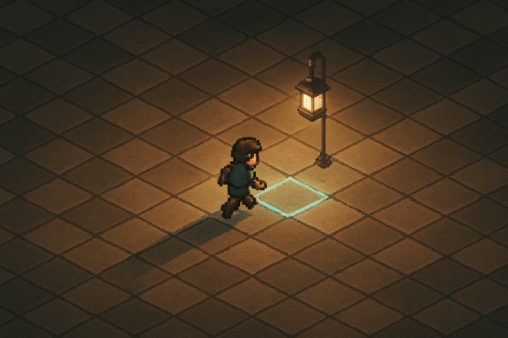

# Movimento em Grid e Input Handling ao Estilo Pokémon

## Sobre este capítulo

A alma de um jogo Pokémon não é o combate — é o **passo tile-a-tile**. Há mil formas de implementar movimento em Godot, e só uma família delas serve a esse gênero: movimento em grid, com snap ao centro de cada tile, interpolação visual entre tiles, bloqueio por colisão, e *by design* single-axis (o jogador anda ou na horizontal ou na vertical, nunca diagonal). Este capítulo ataca o problema em duas camadas: a lógica pura de grid (coordenadas discretas, `RayCast2D` para detecção de obstáculo no tile adjacente, state machine de "idle / moving"), e a camada de apresentação (Tween para interpolar a posição visual sem que o estado lógico deixe de ser inteiro).

Também entra aqui o modelo de **input** do Godot — input map, `Input.is_action_pressed`, `Input.get_vector` — e as armadilhas típicas (input buffering, teclas presas, mudar de direção sem andar — o famoso "turn without step" do Pokémon original).

## Estrutura

Os blocos são: (1) **grid coordinates vs. pixel coordinates** — a disciplina de pensar em tiles e converter por `tile_size` na hora de renderizar; (2) **state machine de movimento** — estados `idle`/`moving` e por que separar input da animação; (3) **detecção de obstáculo** — `RayCast2D` no tile alvo antes de iniciar o movimento, colisão via Tilemap layer; (4) **interpolação com Tween** — visuais suaves sobre lógica discreta, respeitando o ritmo de "um passo por X ms"; (5) **input map e action bindings** — `ui_up/ui_down/ui_left/ui_right` e mapeamento por gamepad; (6) **hands-on** — integrar movimento em grid ao mapa do capítulo anterior com animação de walk direcional.

## Objetivo

Ao fim, o leitor terá um jogador que caminha tile-a-tile por um mapa Pokémon-like, respeita colisões do Tilemap e muda de direção sem andar. Este capítulo entrega o núcleo jogável do protagonista — base sobre a qual transições de mapa, NPCs e rede vão se apoiar.

## Fontes utilizadas

- [Grid-based movement — Godot 4 Recipes (KidsCanCode)](https://kidscancode.org/godot_recipes/4.x/2d/grid_movement/index.html)
- [How to implement Top-down Grid Movement in Godot (Sandro Maglione)](https://www.sandromaglione.com/articles/top-down-grid-movement-in-godot-game-engine)
- [TileMap Movement in Godot (Smartly Dressed Games Blog)](https://blog.smartlydressedgames.com/2024/02/17/tilemap-movement-in-godot/)
- [Make a Pokemon Game in Godot — Player Movement #1 (YouTube)](https://www.youtube.com/watch?v=jSv5sGpnFso)
- [2D Grid-Based Movement (Peanuts Code)](https://www.peanuts-code.com/en/tutorials/gd0010_2d_grid_based_movement/)
