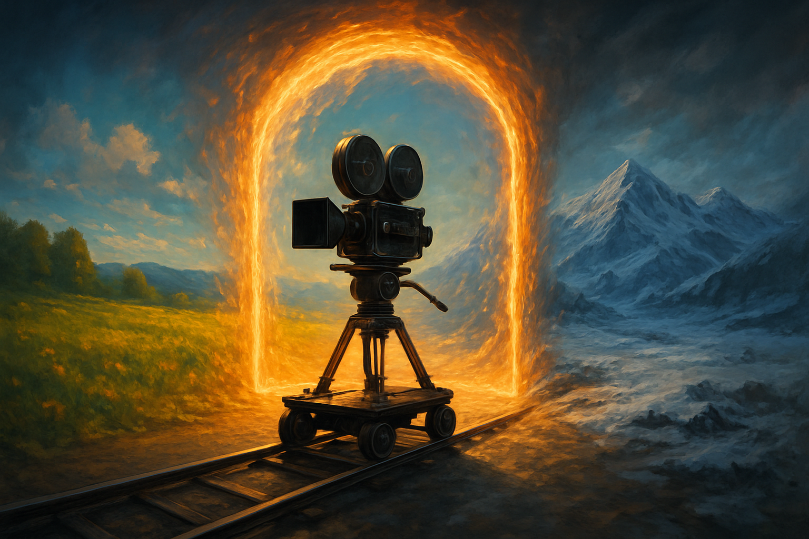

# Câmeras, Transições de Mapa e Salas

## Sobre este capítulo

Com um jogador andando por um mapa, surge imediatamente o problema: *e quando o mapa acaba?* Um Pokémon-like é feito de dezenas de mapas conectados — cidade, rota, prédio, caverna — e a fluidez da travessia entre eles é o que dá a sensação de mundo contínuo. Este capítulo trata dos três mecanismos que sustentam esse efeito: a **câmera** que acompanha o jogador e respeita limites de mapa, o sistema de **salas/áreas de transição** usando `Area2D` e tiles gatilho, e o **carregamento de cenas** com preservação de estado do jogador (HP, party, inventário) entre trocas.

É aqui também que entra a discussão arquitetural sobre "quem é o pai do player": ele vive dentro da cena do mapa atual (e muda de pai ao transitar) ou vive numa cena global persistente (e só o mapa é trocado)? Decisão pequena, consequências enormes para o código que virá, especialmente com a chegada da camada online.

## Estrutura

Os blocos são: (1) **Camera2D** — acompanhar o player, `limit_*` por mapa, smoothing, drag margins; (2) **gatilhos de transição** — `Area2D` + `CollisionShape2D` para detectar saída de mapa, sinais do Tilemap via custom data; (3) **carregamento de cena** — `change_scene_to_file`, `change_scene_to_packed`, cuidados com o ciclo `_ready`; (4) **player persistente** — Autoload vs. player sob Main vs. player sob Map, os três modelos e suas implicações; (5) **fade in/out entre mapas** — `CanvasLayer` + `ColorRect` animado por Tween; (6) **hands-on** — conectar duas salas com um vão, transicionar o player preservando direção de entrada.

## Objetivo

Ao fim do capítulo, o leitor terá dois mapas conectados por um gatilho, câmera correta em ambos, um fade suave na transição e uma arquitetura coerente de persistência do player entre cenas. A partir daqui, o mundo pode crescer indefinidamente sem quebrar o protagonista.

## Fontes utilizadas

- [Godot Engine — Camera2D (class reference)](https://docs.godotengine.org/en/stable/classes/class_camera2d.html)
- [Godot Engine — Change scenes manually (docs)](https://docs.godotengine.org/en/stable/tutorials/scripting/change_scenes_manually.html)
- [Catlike Coding's True Top-Down 2D Tutorial Series — Map Transitions](https://forum.godotengine.org/t/catlike-codings-true-top-down-2d-tutorial-series/84632)
- [Let's Learn Godot 4 by Making an RPG — Camera & Transitions (DEV)](https://dev.to/christinec_dev/lets-learn-godot-4-by-making-an-rpg-part-4-game-tilemap-camera-setup-1mle)
- [How To Create An RPG In Godot - Part 1 (GameDev Academy)](https://gamedevacademy.org/rpg-godot-tutorial/)
