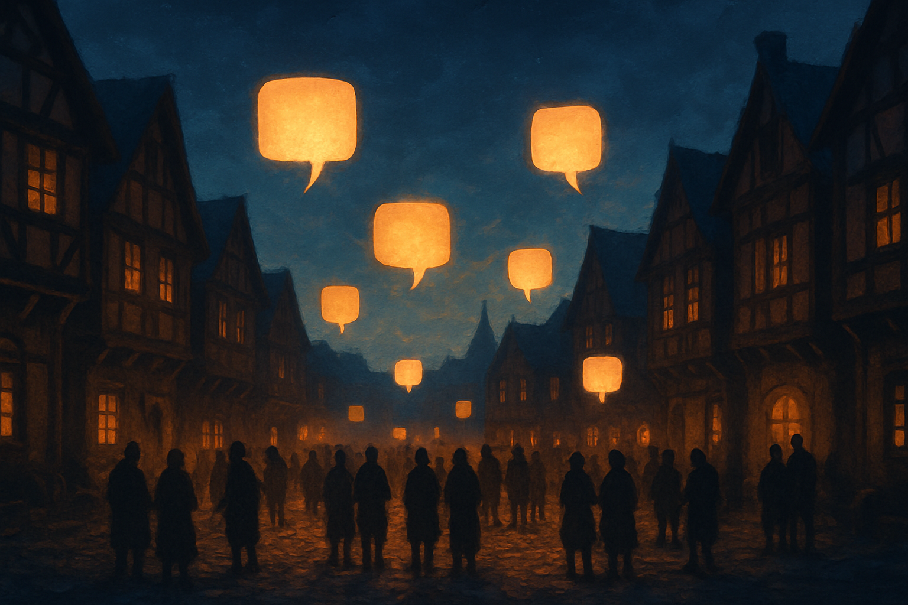

# NPCs, Diálogos e Eventos de Mundo

## Sobre este capítulo

Mundo sem habitantes é cenário. Este capítulo povoa o jogo com **NPCs** — cada um uma pequena máquina de estado com seu próprio sprite, rota de caminhada (ou parada), e *script de interação* disparado quando o jogador aperta A parado à sua frente. Também entra aqui o **sistema de diálogo**: um sub-jogo em si, com caixa de texto, avanço por input, ramificação por escolha, e variáveis de estado (o NPC já foi interpelado? já deu o item?). Finalmente, **eventos de mundo** — aquelas cutscenes simples em que o jogador perde controle por alguns segundos enquanto um NPC se move, fala, e o jogo retoma o controle.

Arquiteturalmente, este capítulo é o primeiro em que o jogo começa a ter *estado semântico*: flags como "falou com o professor" ou "pegou o primeiro Pokémon". Isso antecipa o próximo capítulo (combate por turnos) e o de persistência, onde essas flags precisam viajar para o save — e, mais tarde, para o servidor.

## Estrutura

Os blocos são: (1) **anatomia de um NPC** — `ResourceCharacter`, sprite, trigger de interação via `Area2D`, state machine de comportamento (idle/patrol/talking); (2) **sistema de diálogo** — caixa de texto com digitação, avanço, ramos, sinais de início/fim; (3) **dialogue como dados** — representar diálogos em `Resource` (cada linha, cada ramo) para facilitar escrita e tradução; (4) **eventos de cutscene** — desabilitar input do jogador, mover NPC programaticamente, emitir sinal de fim; (5) **flags globais de mundo** — um Autoload `GameState` que armazena `Dictionary[String, Variant]` de eventos já disparados; (6) **hands-on** — criar um NPC que pede ajuda e só volta a falar com o jogador depois de uma condição cumprida.

## Objetivo

Ao fim do capítulo, o leitor terá pelo menos um NPC interativo com diálogo ramificado e flag global de mundo afetando seu comportamento. Saberá estruturar dezenas desses NPCs reaproveitando o molde, e o jogo começa a ter narrativa. Isso abre caminho para o capítulo de combate, onde NPCs viram *trainers* que desafiam o jogador.

## Fontes utilizadas

- [Godot Engine — Area2D (class reference)](https://docs.godotengine.org/en/stable/classes/class_area2d.html)
- [Godot Engine — Community tutorials index](https://docs.godotengine.org/en/stable/community/tutorials.html)
- [Let's Learn Godot 4 by Making an RPG — NPCs & Dialog (DEV)](https://dev.to/christinec_dev/lets-learn-godot-4-by-making-an-rpg-part-1-project-overview-setup-bgc)
- [How To Create An RPG In Godot — NPCs & Interactions (GameDev Academy)](https://gamedevacademy.org/rpg-godot-tutorial/)
- [Make a 2D Action & Adventure RPG in Godot 4 — Enemies and Dialogue (YouTube)](https://www.youtube.com/playlist?list=PLfcCiyd_V9GH8M9xd_QKlyU8jryGcy3Xa)
