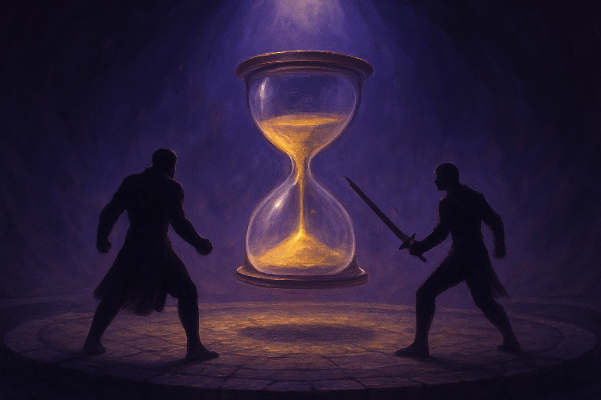

# Combate por Turnos

## Sobre este capítulo

O combate de um Pokémon-like é um mini-jogo fechado dentro do jogo: uma cena separada, com sua própria UI, sua própria lógica, e uma ponte de dados bem definida com o mundo (quais Pokémon o jogador traz, quem é o oponente, o que acontece quando alguém ganha). Este capítulo trata o combate como uma **state machine grande**, onde cada turno é uma pequena trilha de estados (`select_action → select_target → resolve_attack → apply_damage → check_faint → next_turn`). Entram as fórmulas de dano, a ordem de ação por velocidade, efeitos de status mínimos e a UI de batalha (HP bars, menu de ações, animações de ataque).

Este capítulo aparece nesta posição porque depende de quase tudo anterior: scripts, sinais, resources (`PokemonSpecies`, `Move`), mudança de cena (entrar/sair da batalha), e NPCs (o trainer que desafia). Ao fim dele, o jogo está *jogável* em single-player — o mundo tem gente, combate, e o loop básico do gênero fechado.

## Estrutura

Os blocos são: (1) **modelagem de dados** — `Resource`s para `PokemonSpecies`, `Move`, `StatusEffect`, instâncias em tempo de batalha; (2) **o turno como state machine** — estados, transições, sinais disparando cada fase; (3) **fórmulas de dano** — versão simplificada da fórmula Pokémon, tipos, STAB, críticos; (4) **UI de batalha** — HP bars animadas, menu de ações, log de texto; (5) **entrada e saída da batalha** — preservar estado do mundo durante a batalha, retornar resultado (vitória/derrota/captura) para o mapa; (6) **hands-on** — trigger de trainer battle: o NPC do capítulo 9 vira um combate jogável até a vitória.

## Objetivo

Ao fim, o leitor terá uma cena de combate por turnos completa, integrada com NPCs do mundo, alimentada por Resources e retornando resultado. O jogo tem agora seu pilar mecânico central jogável, pronto para receber party, inventário e persistência no capítulo seguinte.

## Fontes utilizadas

- [Godot Engine — Finite State Machines (docs/community)](https://docs.godotengine.org/en/stable/tutorials/scripting/state_machines.html)
- [Let's Learn Godot 4 by Making an RPG — Combat System (DEV)](https://dev.to/christinec_dev/lets-learn-godot-4-by-making-an-rpg-part-1-project-overview-setup-bgc)
- [How To Create An RPG In Godot — Combat (GameDev Academy)](https://gamedevacademy.org/rpg-godot-tutorial/)
- [Make a 2D Action & Adventure RPG in Godot 4 — Combat Scenes (YouTube)](https://www.youtube.com/playlist?list=PLfcCiyd_V9GH8M9xd_QKlyU8jryGcy3Xa)
- [Pokémon damage formula breakdown (Bulbapedia)](https://bulbapedia.bulbagarden.net/wiki/Damage)
