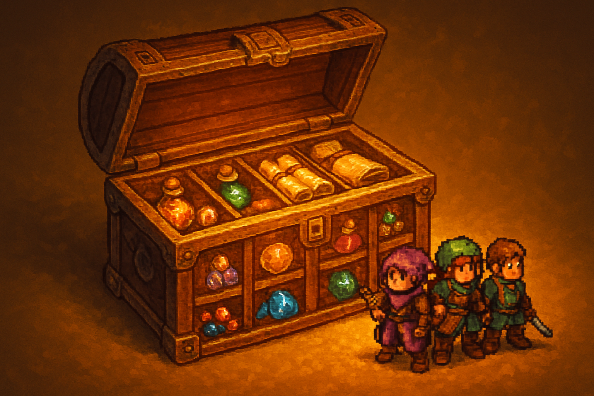

# Party, Inventário e Persistência Local

## Sobre este capítulo

Com o mundo povoado e o combate jogável, falta o **estado longitudinal** do jogador: a *party* de Pokémon que ele leva consigo, o **inventário** de itens, e a capacidade de fechar o jogo, reabrir, e continuar de onde parou. Este capítulo trata dos três problemas juntos porque eles compartilham o mesmo substrato: dados do jogador como `Resource`s serializáveis em disco. O capítulo também introduz o conceito de **save file** em Godot via `ResourceSaver`/`ResourceLoader`, com uma discussão explícita sobre a armadilha de usar `ResourceSaver` cru para saves (problemas de segurança e versionamento) e as alternativas seguras (`FileAccess` + JSON ou serialização custom).

Este capítulo fecha a versão single-player do jogo. A partir do próximo, o estado deixa de ser exclusivo do cliente e passa a ser compartilhado com o servidor — o que muda tudo sobre como ele é armazenado e confiado.

## Estrutura

Os blocos são: (1) **Party** — `Array[ResourcePokemonInstance]` no `GameState` Autoload, operações de swap, heal, add, remove; (2) **Inventário** — slots, stackable, categoria, uso de item dentro e fora da batalha; (3) **UI de menu** — acessar party e inventário pelo menu pausa, navegação por teclado; (4) **save/load** — `FileAccess` + JSON, versionamento de save (`save_version`), migração entre versões; (5) **corner cases** — save durante combate, save em mapa em transição; (6) **hands-on** — salvar o jogo em `user://save.json`, fechar o Godot, reabrir, e continuar com party e posição preservadas.

## Objetivo

Ao fim, o jogo é uma experiência single-player completa: mundo, NPCs, combate, party, inventário, save. O leitor tem o molde para versionar saves ao longo do tempo e entende por que `ResourceSaver` puro é insuficiente para saves de produção. Com o jogo fechado em si, o livro pivota para o online.

## Fontes utilizadas

- [Godot Engine — Saving games (docs oficiais)](https://docs.godotengine.org/en/stable/tutorials/io/saving_games.html)
- [Godot Engine — FileAccess (class reference)](https://docs.godotengine.org/en/stable/classes/class_fileaccess.html)
- [Godot Engine — ResourceSaver (class reference)](https://docs.godotengine.org/en/stable/classes/class_resourcesaver.html)
- [Let's Learn Godot 4 by Making an RPG — Save System (DEV)](https://dev.to/christinec_dev/lets-learn-godot-4-by-making-an-rpg-part-1-project-overview-setup-bgc)
- [Make a 2D Action & Adventure RPG in Godot 4 — Inventory System (YouTube)](https://www.youtube.com/playlist?list=PLfcCiyd_V9GH8M9xd_QKlyU8jryGcy3Xa)
