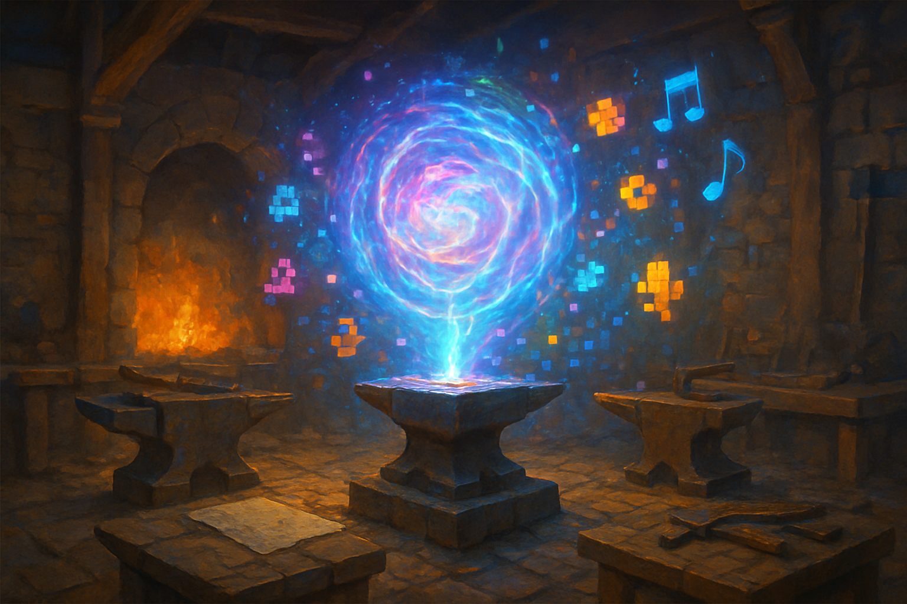

# Pipeline de Assets com AI: Sprites, Tilesets e Trilha Sonora

## Sobre este capítulo

Este capítulo fecha o livro conectando a fundação técnica (Godot + Pokémon-like + online) ao diferencial declarado do projeto do leitor: usar modelos generativos como **amplificador criativo** na produção de arte e música. Aqui entra um pipeline prático de três rotas — sprites de personagens e NPCs, tilesets/tiles de mundo, e loops de trilha sonora — cada uma com seu fluxo característico: prompt inicial, iteração de consistência (mesma paleta, mesma direção de luz, mesmo "estilo Pokémon"), pós-processamento (redimensionamento, quantização de cores para pixel-art autêntico) e importação no projeto Godot já estruturado.

O capítulo **não** é um tutorial de prompt engineering genérico — o leitor já tem essa fluência. O valor está em formalizar o pipeline: como gerar *consistência* em vez de uma imagem isolada, como encaixar os outputs nos Resources do projeto (capítulo 5), e como isso serve de ponte para os próximos livros do método (arquitetura de MMO, mecânicas de RPG, produção de arte com AI em escala).

## Estrutura

Os blocos são: (1) **panorama de modelos para pixel-art** — gpt-image-1, Midjourney, Stable Diffusion com LoRAs de pixel-art, trade-offs de custo e consistência; (2) **pipeline de sprites de personagens** — prompt-template com paleta fixa, geração 4-direcional, pós-processamento (quantização, remoção de fundo), importação em `SpriteFrames`; (3) **pipeline de tilesets** — geração de tiles coerentes, autotiling manual com Godot, atlas fixo; (4) **pipeline de trilha sonora** — modelos para música loopável (Suno, Udio, MusicGen), estrutura de faixas por mapa, normalização de volume; (5) **automação** — scripts que vão do prompt ao `.tres`/`.png` final sem intervenção manual; (6) **hands-on** — gerar um NPC completo (4 direções de walk) e um loop de música de cidade, importar no projeto e vê-los em funcionamento.

## Objetivo

Ao fim, o leitor terá um pipeline reprodutível de geração de assets alimentando o projeto Godot, e entenderá o custo, os limites e os truques de consistência dos modelos de 2026. Encerrando a travessia, o jogador está jogável, o mundo está online e os assets nascem via AI — a trilha ancorada para os livros seguintes do método (arquitetura MMO, arte AI em escala, mecânicas avançadas de RPG).

## Fontes utilizadas

- [Top Game Development Trends of 2026 (Relish Games)](https://relishgames.com/journal/top-game-development-trends-of-2026/)
- [OpenAI — Image generation API (docs)](https://platform.openai.com/docs/guides/images)
- [Retro Diffusion — pixel-art diffusion models overview](https://www.retrodiffusion.ai/)
- [Suno AI — music generation](https://suno.com/)
- [Meta MusicGen — open music generation (Audiocraft GitHub)](https://github.com/facebookresearch/audiocraft)
- [Godot Engine — Importing images (docs)](https://docs.godotengine.org/en/stable/tutorials/assets_pipeline/importing_images.html)
