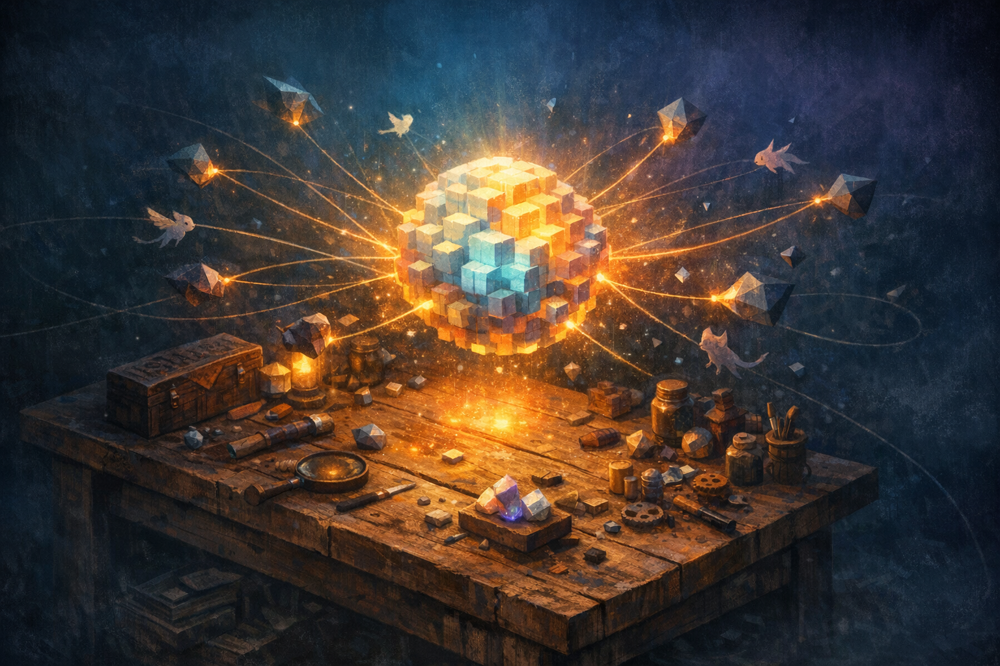

# Godot para um RPG 2D Online Estilo Pokémon

## Sobre este livro

Este livro é um recorte vertical do universo de gamedev: a travessia de quem já é engenheiro de software experiente — mas nunca abriu uma engine — até ter um RPG 2D top-down, online e jogável, construído em Godot 4. O foco não é "aprender Godot" no abstrato, e sim aprender Godot **com a finalidade específica** de construir um jogo no molde de Pokémon Fire Red rodando em modo multiplayer. Tudo que não serve a esse alvo (3D, shaders cinematográficos, pipelines AAA) fica de fora; tudo que serve (Tilemaps, Node2D, sinais, AnimatedSprite2D, escultura de cenas, ENet/WebSocket, sincronização de estado, persistência) entra.

A proposta é construir uma fundação técnica que respeite o background do leitor — alguém que pensa naturalmente em sistemas distribuídos, persistência e arquitetura — e o conecte ao vocabulário próprio de gamedev: game loop, delta time, sistemas de cena, scripting baseado em nós, signals, tilemaps autoritativos, replicação de estado e tick rates.

## Estrutura

Os grandes blocos são: (1) fundamentos da arquitetura do Godot que importam para um RPG 2D — nós, cenas, scripts, sinais, recursos, AnimatedSprite2D, Tilemaps; (2) os sistemas centrais de um Pokémon-like — movimento em grid, tilemaps de mundo, NPCs e diálogos, combate por turnos, inventário e party; (3) a camada online — modelo cliente-servidor, autoridade do servidor, sincronização de estado, ENet/WebSocket, persistência; (4) a integração com a pipeline de assets gerados por AI — sprites, tilesets e trilhas sonoras —, preparando o terreno para os outros livros do método.

## Objetivo

Ao terminar, o leitor terá uma compreensão funcional e prática do Godot 4 suficiente para sustentar um projeto pessoal de longa duração, terá uma decisão técnica fundamentada sobre o uso da engine para esse tipo de jogo, e estará apto a continuar nos livros sobre arquitetura de MMOs, pipeline de arte com AI e mecânicas de RPG sem precisar revisitar fundamentos. O entregável esperado, ao fim da trilha, é um protótipo navegável de um RPG 2D top-down rodando em rede entre dois ou mais clientes, com pelo menos um sistema de combate básico e um pipeline mínimo de assets gerados via AI já integrado ao projeto.

## Sobre o leitor

O leitor deste livro é um **engenheiro de software sênior**, com forte experiência prática em **desenvolvimento mobile e engenharia de dados**. Está confortável escrevendo software de produção, raciocinando sobre arquitetura, integrando sistemas distribuídos e operando pipelines de dados. Programação, em si, não é um obstáculo: ler código novo, entender abstrações, compor sistemas e depurar problemas complexos já fazem parte do seu dia a dia.

Em paralelo, ele tem **experiência hands-on com APIs de modelos generativos** — já trabalhou com OpenAI (via API), Midjourney, Gemini e Claude. Está familiarizado com os ritmos da geração assistida por AI: prompts, iteração, custos, limitações, fluxos de refinamento. Esse conhecimento é central para o objetivo do projeto, que envolve gerar arte e música via AI como parte estruturante do pipeline de assets. O **objetivo declarado** é, no momento, um projeto pessoal: construir, a longo prazo, um jogo 2D online no espírito de Pokémon Fire Red, usando AI como amplificador na produção de arte e trilha sonora.

O **ponto de partida em gamedev é zero**: nunca abriu Godot, Unity, Unreal ou qualquer engine; não tem modelo mental de game loop, nodes, scenes, sprites, tilemaps ou sincronização de estado em jogos online. É exatamente nessa fronteira — entre a fluência de engenharia de software que ele já tem e o vocabulário/estrutura mental específicos de gamedev — que este livro opera.

## Capítulos

1. [Introdução — Por que Godot 4 para um RPG 2D online no estilo Pokémon](01-introducao/CONTENT.md) — briefing estratégico da escolha de engine, recorte do jogo-alvo e mapa do livro.
2. [Nodes, Scenes e a Árvore de Cena](02-nodes-scenes-e-a-arvore-de-cena/CONTENT.md) — a mudança de paradigma central do Godot: jogo como árvore de nós compostos em cenas reutilizáveis.
3. [Game Loop, Delta Time e o Editor em Prática](03-game-loop-delta-time-e-o-editor-em-pratica/CONTENT.md) — como a engine executa seu jogo por trás, com `_process`, `_physics_process` e o ciclo de frames.
4. [GDScript e Sinais: Scripts em Nós e Comunicação Desacoplada](04-gdscript-e-sinais/CONTENT.md) — a linguagem de scripting do Godot e o mecanismo de `signals` como alternativa a callbacks/observers.
5. [Sprites, AnimatedSprite2D e Resources](05-sprites-animatedsprite2d-e-resources/CONTENT.md) — o pipeline visual 2D, `Resource` como recurso reutilizável e animação por frames.
6. [Tilemaps e Tilesets: a Espinha Dorsal do Mundo](06-tilemaps-e-tilesets/CONTENT.md) — como construir os mapas de um RPG top-down com `TileMapLayer`, autotiles e camadas físicas.
7. [Movimento em Grid e Input Handling ao Estilo Pokémon](07-movimento-em-grid-e-input-handling/CONTENT.md) — deslocamento tile-a-tile, interpolação visual e bloqueio por colisão.
8. [Câmeras, Transições de Mapa e Salas](08-cameras-transicoes-de-mapa-e-salas/CONTENT.md) — `Camera2D`, sistema de salas, troca de cena com preservação de estado do jogador.
9. [NPCs, Diálogos e Eventos de Mundo](09-npcs-dialogos-e-eventos-de-mundo/CONTENT.md) — população do mapa, máquinas de estado de NPC, sistema de diálogo e eventos scriptados.
10. [Combate por Turnos](10-combate-por-turnos/CONTENT.md) — loop de batalha, state machines, cálculo de dano, UI de batalha e integração com a party.
11. [Party, Inventário e Persistência Local](11-party-inventario-e-persistencia-local/CONTENT.md) — sistemas de estado do jogador, `Resource`-based data e save/load em disco local.
12. [Multiplayer em Godot: Arquitetura Cliente-Servidor, ENet e WebSocket](12-multiplayer-arquitetura-cliente-servidor/CONTENT.md) — modelos de rede, escolha de transport, servidor dedicado em modo headless.
13. [Sincronização de Estado e Autoridade do Servidor](13-sincronizacao-de-estado-e-autoridade/CONTENT.md) — replicação de nós, `MultiplayerSynchronizer`, tick rate e anti-cheat mínimo.
14. [Persistência Server-side e Mundo Compartilhado](14-persistencia-server-side-e-mundo-compartilhado/CONTENT.md) — banco no servidor, contas, mundo compartilhado e salvamento remoto.
15. [Pipeline de Assets com AI: Sprites, Tilesets e Trilha Sonora](15-pipeline-de-assets-com-ai/CONTENT.md) — integração do fluxo generativo (OpenAI/Midjourney/modelos de música) ao projeto Godot.

## Fontes utilizadas

- [Godot Engine — site oficial](https://godotengine.org/)
- [Godot Engine — documentação oficial](https://docs.godotengine.org/)
- [Phaser vs Godot for 2D Games: Complete Comparison](https://generalistprogrammer.com/tutorials/phaser-vs-godot-2d-games)
- [I attempted to make the same 2D game prototype in different game engines (freeCodeCamp)](https://www.freecodecamp.org/news/how-i-made-a-2d-prototype-in-different-game-engines/)
- [Game Development Roadmap 2026 (Codelivly)](https://codelivly.com/game-development-roadmap/)
- [Top Game Development Trends of 2026 (Relish Games)](https://relishgames.com/journal/top-game-development-trends-of-2026/)
- [Why Unity, Godot, and Unreal Engines Are Not Making an Impact in Web Game Development (Gamezop)](https://medium.com/gamezop/why-unity-godot-and-unreal-engines-are-not-making-an-impact-in-web-game-development-1b1ef6dc49d1)
- [Roadmaps for Game Dev SUCCESS in 2026 (Game Dev Report)](https://gamedevreport.beehiiv.com/p/roadmaps-for-game-dev-success-in-2026-beginner-intermediate-marketing)
