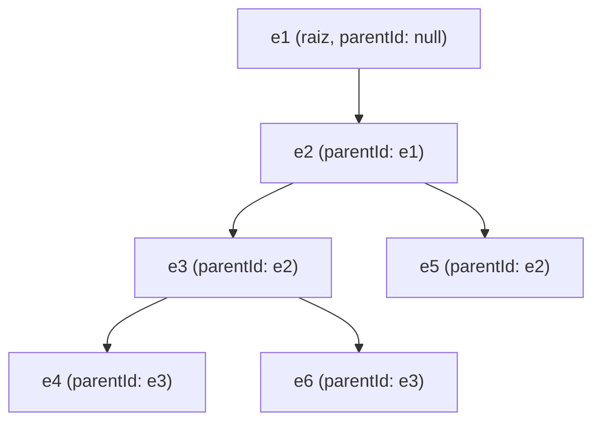
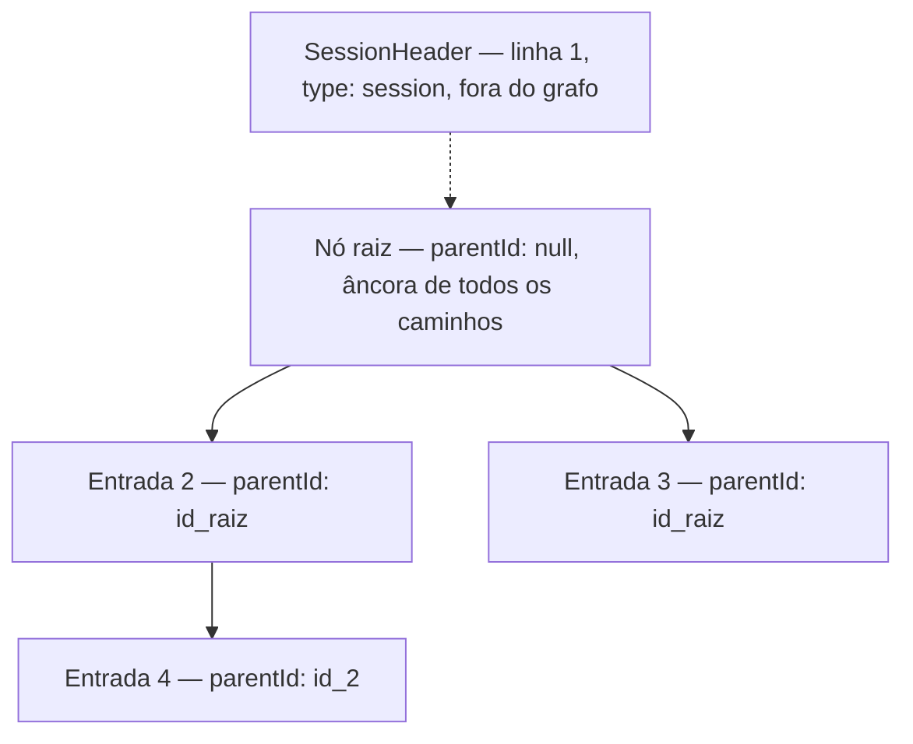
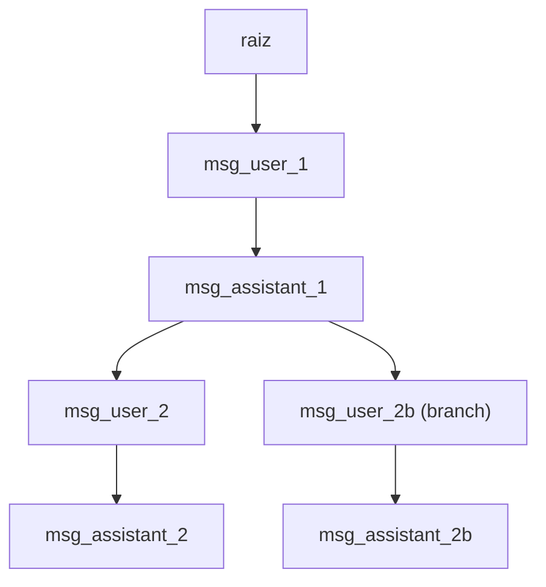
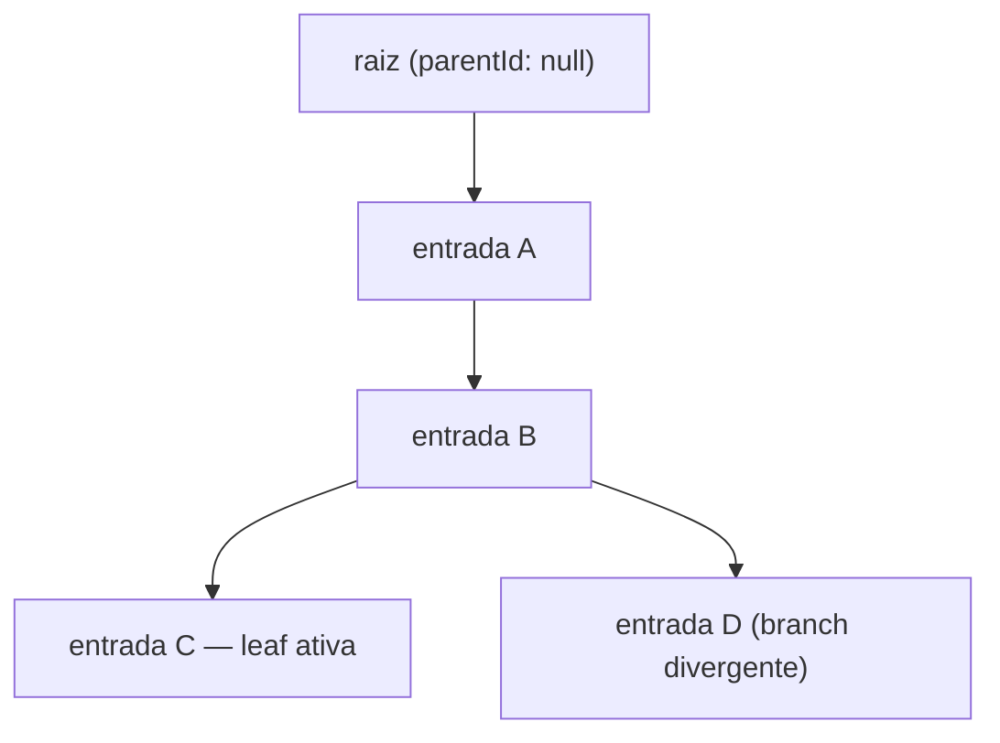
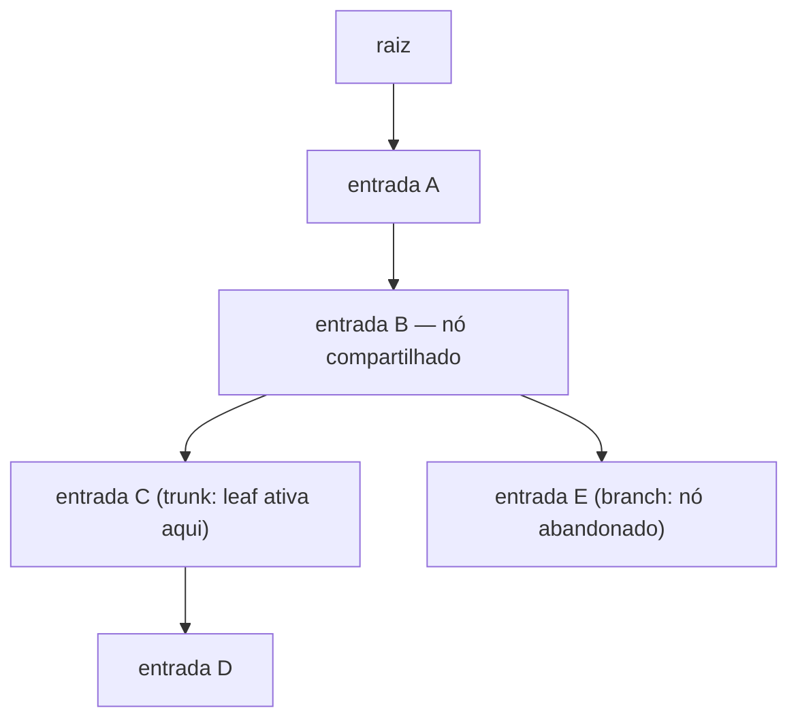

# Conceitos: A Árvore de Sessão — DAG, Trunk e Branches

> Uma vez compreendido o esquema de cada linha do arquivo JSONL, o próximo passo é entender o que o conjunto de linhas forma: não uma lista cronológica linear, mas um grafo dirigido acíclico (DAG). O campo `parentId` transforma o arquivo num grafo onde cada nó aponta para seu predecessor — e onde múltiplos nós podem apontar para o mesmo `parentId`, criando bifurcações. Este subcapítulo constrói a intuição geométrica da estrutura: o que é o trunk (o caminho principal desde a raiz até a posição ativa), o que é um branch (um caminho alternativo que divergiu a partir de um nó compartilhado), e como múltiplos branches coexistem no mesmo arquivo físico sem se interferirem.

## Roteiro

1. O DAG formado por `parentId` — como a cadeia de referências `id → parentId` de cada linha até `parentId: null` forma um grafo dirigido acíclico, e por que essa estrutura é um DAG e não uma árvore binária convencional nem um log linear
2. O nó raiz e o `SessionHeader` como âncora do grafo — por que a primeira entrada com `parentId: null` é o único nó sem predecessores, como ela ancora toda a estrutura e o que acontece se ela for perdida ou corrompida
3. A leaf (folha ativa) como posição presente da sessão — o que define uma leaf (nó sem filhos no caminho atual), como o `SessionManager` a rastreia, e por que "mover-se na árvore" significa exatamente trocar a leaf ativa
4. Trunk — o caminho canônico da raiz à leaf ativa — definição precisa de trunk como o conjunto ordenado de entradas no caminho da raiz até a posição atual, e como `buildSessionContext()` percorre esse caminho de volta (leaf → root) para montar o contexto enviado ao LLM
5. Branch — divergência a partir de um nó compartilhado — o que torna um caminho um branch (dois ou mais filhos do mesmo `parentId`), a distinção entre trunk e branch como relativa à leaf ativa (não absoluta ao arquivo), e o que acontece com o branch abandonado quando a leaf muda
6. Coexistência de branches no arquivo físico e o índice in-memory do `SessionManager` — por que as linhas de diferentes branches estão intercaladas no arquivo em ordem de timestamp de escrita (não segregadas por bloco), como o `SessionManager` constrói o mapa `id → entrada` ao ler o arquivo, e como `getBranch(leafId)` isola um caminho lógico completo dentro do arquivo compartilhado

## 1. O DAG formado por `parentId`

No subcapítulo anterior (`01-anatomia-de-uma-entrada-jsonl`), o conceito 3 mostrou que cada `SessionMessageEntry` carrega `parentId: string | null` — um ponteiro para o `id` da entrada imediatamente anterior no caminho ativo. Uma entrada com `parentId: null` é a raiz; as demais apontam cada uma para seu predecessor. Esse mecanismo, sozinho, constrói uma estrutura de grafo: os nós são as entradas, as arestas são as relações `parentId → id`, e a direção das arestas é de filho para pai (da entrada mais recente em direção à raiz).

A estrutura resultante é um DAG — grafo dirigido acíclico. Os três atributos da sigla têm leitura precisa aqui:

- **Dirigido**: cada aresta tem direção única, de filho para pai. Não há aresta bidirecional — uma entrada conhece seu predecessor (via `parentId`), mas um pai não referencia diretamente seus filhos (para saber os filhos de um nó, o `SessionManager` precisa varrer o índice de entradas e perguntar quais têm `parentId == id` do nó em questão).
- **Acíclico**: seguindo as arestas `parentId` a partir de qualquer entrada, inevitavelmente chega-se à raiz (`parentId: null`). Não é possível retornar ao ponto de partida — o grafo nunca forma um ciclo, porque cada entrada precisa ter sido escrita depois de seu pai (append-only em ordem cronológica).
- **Grafo**: a estrutura admite que um nó pai tenha múltiplos filhos. Quando dois turnos de conversa divergem a partir do mesmo ponto — o usuário envia mensagens diferentes após o mesmo contexto — ambas as novas entradas são escritas com o mesmo `parentId`. O pai tem dois filhos. Isso é o que o conceito de branch significa estruturalmente, e é o que diferencia esse DAG de uma lista encadeada linear: num log linear, cada nó tem exatamente um filho ou zero; neste DAG, um nó pode ter zero, um ou múltiplos filhos.

A distinção entre DAG e árvore convencional merece atenção porque as duas estruturas são frequentemente confundidas. Uma árvore (no sentido formal) exige que cada nó, exceto a raiz, tenha **exatamente um pai** — e o arquivo de sessão do pi.dev satisfaz essa restrição em ambas as direções: cada entrada tem no máximo um `parentId`. Então na direção filho-para-pai, a estrutura é uma árvore. O que faz o termo "DAG" ser mais preciso aqui é enfatizar que a leitura útil da estrutura é **da raiz para as folhas** — e nessa direção, um nó pode ter múltiplos filhos, criando bifurcações. Uma árvore binária restringiria cada nó a no máximo dois filhos; um DAG geral não tem esse limite. O pi.dev não impõe restrição de fanout: o mesmo ponto da conversa pode ser o ancestral de dezenas de branches divergentes (incomum na prática, mas válido pelo schema).

A distinção em relação a um log linear é igualmente importante para quem vai projetar persistência. Um log linear (como o modelo de sessão da maioria dos chatbots) é um array de mensagens em ordem cronológica — para "desfazer" uma resposta, o sistema trunca o array. O DAG do pi.dev não trunca nunca: ele acrescenta novas entradas que apontam para um `parentId` anterior, deixando o caminho não-escolhido intacto no arquivo. Isso tem implicações diretas para storage que os subcapítulos `05-append-only-como-contrato-de-persistencia-efs-vs-s3` e `09-sessionmanager-customizado-backed-por-s3` cobrem — um objeto S3 que se comporta como array truncável não mapeia bem sobre um arquivo cuja integridade depende de nunca perder linhas já escritas.

Para concretizar a topologia: considere um arquivo com seis entradas. As quatro primeiras formam um caminho linear (e1 → e2 → e3 → e4). A quinta entrada tem `parentId: "e2"` — ela bifurca a partir de e2, criando um caminho alternativo. A sexta tem `parentId: "e3"` — outro branch a partir de e3.



No arquivo JSONL, essas seis linhas aparecem em ordem de escrita — e1, e2, e3, e4 chegaram primeiro; e5 e e6 foram escritos depois, quando o usuário criou branches. A posição no arquivo não reflete a topologia lógica; quem define a topologia é exclusivamente o `parentId`. O `SessionManager`, ao ler o arquivo, constrói o índice `id → entrada` varrendo linha a linha — ele não precisa que as entradas estejam em nenhuma ordem topológica no arquivo para reconstruir o grafo corretamente. Esse índice é o que permite depois navegar da leaf ativa até a raiz via `parentId` (O(profundidade)) sem releitura do arquivo.

**Fontes utilizadas:**

- [Pi Coding Agent — Session Format (docs oficiais)](https://pi.dev/docs/latest/session-format)
- [Session Management and Persistence — DeepWiki (agentic-dev-io/pi-agent)](https://deepwiki.com/agentic-dev-io/pi-agent/2.4-session-management-and-persistence)
- [Directed acyclic graph — Wikipedia](https://en.wikipedia.org/wiki/Directed_acyclic_graph)
- [Session tree format — Issue #316 (badlogic/pi-mono)](https://github.com/badlogic/pi-mono/issues/316)
- [Sessions as Trees, Code as Clay — random.qmx.me](https://random.qmx.me/posts/2026/02/19/sessions-as-trees/)
- [pi-mono session.md — badlogic/pi-mono (docs oficiais)](https://github.com/badlogic/pi-mono/blob/HEAD/packages/coding-agent/docs/session.md)
- [Pi hash-addressed sessions — Gordon Brander (gist)](https://gist.github.com/gordonbrander/70b3caf6ee5414ee7f9ee7516424b1ed)

## 2. O nó raiz e o `SessionHeader` como âncora do grafo

O conceito anterior estabeleceu a topologia: nós, arestas dirigidas de filho para pai, acicidade garantida pela natureza append-only da escrita. A pergunta que fica em aberto é qual nó inicia a cadeia — quem é o ponto sem predecessores que ancora o grafo inteiro.

A resposta envolve duas entidades distintas que são frequentemente confundidas: o `SessionHeader` e o nó raiz. Elas aparecem no mesmo arquivo, têm papéis complementares, mas são estruturalmente diferentes.

O `SessionHeader` é sempre a primeira linha do arquivo JSONL. Seu campo `type` é `"session"`, e ele carrega os metadados da sessão como um todo: `version` (atualmente 3, usado pelo `SessionManager` para decidir se precisa rodar migração antes de ler o resto do arquivo), `id` (UUID da sessão), `timestamp` (criação), `cwd` (diretório de trabalho no momento da criação) e, opcionalmente, `parentSession` (caminho para o arquivo de outra sessão, preenchido quando a sessão foi criada via `/fork` ou `newSession({ parentSession })`). O `SessionHeader` **não tem** campos `id` nem `parentId` no sentido das entradas de conversa — ele existe fora da topologia do grafo. Não é um nó que você percorre via `parentId`; é um envelope de contexto que precede todos os nós.

O nó raiz, por sua vez, é a primeira `SessionMessageEntry` do arquivo — a entrada com `parentId: null`. Esse é o único nó que pertence ao grafo e não tem predecessores. A partir dele, toda a cadeia de `parentId` se propaga para frente (no sentido da conversa) ou, dito de outra forma: seguindo as arestas de qualquer nó do arquivo em direção ao `parentId: null`, você sempre chega aqui e nunca sai daqui para lugar algum.

A distinção prática importa porque o `SessionManager`, ao ler o arquivo, processa a linha 1 como `SessionHeader` (extrai versão, configura migração, carrega `cwd`) e só a partir da linha 2 começa a construir o índice `id → entrada` do grafo. Se o `SessionHeader` estiver ausente ou mal-formado, o `SessionManager` não consegue determinar qual versão do schema esperar, e a migração automática falha antes mesmo de começar a varrer as entradas. A sessão toda torna-se ilegível — não porque os dados de conversa sumiram, mas porque a porta de entrada foi bloqueada. Se o `SessionHeader` for corrompido apenas parcialmente (campo `version` inválido, JSON mal-fechado na linha 1), o comportamento depende de quanto o parser consegue recuperar, mas o caso seguro é tratar a perda do cabeçalho como perda de toda a sessão.

A perda do nó raiz é diferente em natureza, mas igualmente catastrófica para o grafo. Sem a entrada com `parentId: null`, qualquer tentativa de percorrer um caminho da leaf até a raiz (o que `buildSessionContext()` faz, como o conceito 4 do roteiro detalha) termina numa referência dangling — o `parentId` de alguma entrada aponta para um `id` que não existe no índice in-memory. O `SessionManager` mantém o mapa `id → entrada` construído linha a linha; uma referência para um `id` ausente resulta em caminho truncado, e o contexto enviado ao LLM estará incompleto sem o início da conversa. A diferença em relação a uma entrada intermediária corrompida é de grau: uma entrada intermediária trunca o ramo acima dela; a raiz trunca todos os ramos simultaneamente — porque todo caminho lógico do arquivo passa pelo nó raiz.



A seta tracejada do `SessionHeader` para o nó raiz não representa uma aresta do grafo — representa a sequência de leitura do arquivo. O `SessionManager` lê o `SessionHeader`, configura o contexto da sessão, e então lê as entradas de grafo a partir do nó raiz. A consequência para persistência é direta: ao salvar uma sessão em S3 ou replicar em EFS, as primeiras duas linhas do arquivo (o `SessionHeader` e o nó raiz) são as mais críticas de preservar. Uma estratégia de backup que salva apenas "as últimas N entradas do arquivo" perde exatamente o que ancoras o grafo.

Há um detalhe no `parentSession` do `SessionHeader` que prefigura o conceito de fork (subcapítulo `04-fork-e-branch-na-pratica-criar-e-navegar`): quando uma sessão é forked, o novo arquivo começa com um `SessionHeader` que aponta via `parentSession` para o arquivo original. Isso cria uma ligação **entre arquivos**, distinta da ligação **dentro do arquivo** que o DAG de `parentId` representa. O nó raiz do novo arquivo tem `parentId: null` — ele é raiz dentro de seu próprio grafo. O ponteiro inter-arquivo fica exclusivamente no `SessionHeader`. Esse design mantém a propriedade de que qualquer arquivo de sessão é autossuficiente para reconstruir sua árvore interna, sem precisar carregar o arquivo-pai para navegar os nós locais.

**Fontes utilizadas:**

- [Pi Coding Agent — Session Format (docs oficiais)](https://pi.dev/docs/latest/session-format)
- [Session Management and Persistence — DeepWiki (agentic-dev-io/pi-agent)](https://deepwiki.com/agentic-dev-io/pi-agent/2.4-session-management-and-persistence)
- [Directed acyclic graph — Wikipedia](https://en.wikipedia.org/wiki/Directed_acyclic_graph)
- [Session tree format — Issue #316 (badlogic/pi-mono)](https://github.com/badlogic/pi-mono/issues/316)
- [Sessions as Trees, Code as Clay — random.qmx.me](https://random.qmx.me/posts/2026/02/19/sessions-as-trees/)
- [pi-mono session.md — badlogic/pi-mono (docs oficiais)](https://github.com/badlogic/pi-mono/blob/HEAD/packages/coding-agent/docs/session.md)
- [Pi hash-addressed sessions — Gordon Brander (gist)](https://gist.github.com/gordonbrander/70b3caf6ee5414ee7f9ee7516424b1ed)

## 3. A leaf (folha ativa) como posição presente da sessão

O grafo definido pelo DAG de `parentId` não tem, por si só, uma noção de "onde estou agora". Um arquivo de sessão com quatro branches divergentes é um grafo completo e estático — mas o `SessionManager` precisa saber qual dos nós terminais representa o estado atual da conversa para determinar o que enviar ao LLM no próximo turno. Esse nó é a leaf ativa.

A definição estrutural de leaf é simples: um nó sem filhos. No DAG do pi.dev, isso significa uma entrada que não aparece como `parentId` de nenhuma outra entrada no arquivo. Em qualquer arquivo com pelo menos um branch divergente existem múltiplas folhas simultâneas — cada branch termina numa folha diferente. O que transforma uma folha em "leaf ativa" não é a estrutura do grafo, mas o estado do `SessionManager`: ele mantém internamente um ponteiro — `getLeafId()` retorna seu valor — que aponta para a folha que define o caminho atual da sessão.

Toda operação de escrita no arquivo depende desse ponteiro. Quando o usuário envia uma mensagem, o `SessionManager` cria uma nova entrada com `parentId` igual ao `id` retornado por `getLeafId()`, escreve essa linha no arquivo, e atualiza o ponteiro para apontar para a nova entrada. A nova entrada passa a ser a leaf ativa. O grafo cresce um nó, e a sessão avança um passo. Se o ponteiro estivesse errado — apontando para um nó que já tem filhos, por exemplo — a nova entrada entraria como um segundo filho desse nó, criando involuntariamente um branch onde o usuário não pediu divergência.

"Mover-se na árvore" significa exatamente mudar para qual folha o ponteiro aponta. O `/tree` do pi.dev exibe o grafo inteiro e marca a posição ativa com `← active`. Quando o usuário seleciona uma entrada diferente via `/tree`, o `SessionManager` chama `branch(entryId)` internamente, que move o ponteiro da leaf ativa para o nó escolhido. A partir daquele momento, `getLeafId()` retorna o novo valor, e qualquer escrita subsequente parte dali — sem apagar nada do grafo já existente. O caminho anterior fica intacto no arquivo; ele simplesmente deixou de ser o caminho ativo.

O comportamento difere levemente dependendo do tipo de entrada selecionada no `/tree`. Se o usuário seleciona uma entrada de usuário (uma mensagem que ele mesmo enviou), a leaf ativa move para o pai daquela entrada — e o texto da mensagem volta ao editor para edição. O objetivo é que a próxima submissão crie um novo filho do nó pai, divergindo dali. Se o usuário seleciona uma entrada de assistant ou de tool response, a leaf vai diretamente para aquela entrada — o editor fica vazio e o usuário pode continuar de onde o agente parou. Nos dois casos, o arquivo não sofre modificação; apenas o ponteiro in-memory muda.



Nesse grafo, se a leaf ativa é `msg_assistant_2b` (o nó `f`), o caminho ativo é `r → a → b → e → f`. O nó `d` também é uma folha — ele não tem filhos — mas não é a leaf ativa. Quando o `SessionManager` percorre o grafo de volta para montar o contexto do LLM (o que `buildSessionContext()` faz, detalhado no conceito 4), ele parte de `f` e sobe via `parentId` até `r`, ignorando completamente os nós `c` e `d`. Eles existem no arquivo, mas estão fora do caminho ativo.

A consequência prática para persistência — que os capítulos 8 e 9 exploram — é que salvar "a leaf ativa" não é suficiente para restaurar o estado da sessão. O que precisa ser persistido é o arquivo JSONL inteiro mais o valor do ponteiro de leaf. Sem o arquivo, não há grafo para navegar. Sem o ponteiro, o `SessionManager` teria que inferir a leaf ativa por heurística (a entrada sem filhos de maior timestamp, por exemplo) — o que pode ser correto para sessões lineares, mas é ambíguo quando existem múltiplos branches simultaneamente ativos em diferentes sessões do mesmo arquivo.

**Fontes utilizadas:**

- [Pi Coding Agent — Sessions (docs oficiais)](https://pi.dev/docs/latest/sessions)
- [Session Tree Navigation — pi.dev/docs/latest/tree](https://pi.dev/docs/latest/tree)
- [Session Management and Persistence — DeepWiki (agentic-dev-io/pi-agent)](https://deepwiki.com/agentic-dev-io/pi-agent/2.4-session-management-and-persistence)
- [Tree (abstract data type) — Wikipedia](https://en.wikipedia.org/wiki/Tree_(abstract_data_type))

## 4. Trunk — o caminho canônico da raiz à leaf ativa

O conceito anterior deixou a leaf ativa como o ponteiro do `SessionManager` para a posição presente da sessão. Trunk é o nome para o objeto gerado quando você percorre o grafo a partir dessa leaf: o conjunto ordenado de entradas que compõem o caminho da raiz até a leaf ativa, sem nenhum nó de outro branch incluído.

A definição é relacional: trunk não é uma propriedade intrínseca de um conjunto de nós no arquivo JSONL, mas uma função da leaf ativa. Se a leaf ativa mudar — porque o usuário selecionou outra folha via `/tree` ou porque o `SessionManager` foi instruído a chamar `branch(entryId)` —  o mesmo arquivo produz um trunk diferente. Um nó que estava no trunk passa a estar num branch abandonado, e vice-versa. A distinção trunk/branch é sempre relativa ao estado do ponteiro, nunca absoluta ao arquivo.

A construção do trunk começa na leaf ativa e percorre o grafo em direção à raiz via `parentId`, acumulando entradas em ordem reversa e invertendo ao final. O percurso é linear: cada entrada tem exatamente um `parentId` (exceto a raiz, que tem `null`), então não há bifurcação possível subindo o grafo — o caminho é único. O que `getBranch(leafId)` faz é exatamente esse percurso: ele recebe o `id` da leaf ativa, consulta o índice in-memory `id → entrada` mantido pelo `SessionManager`, sobe de `parentId` em `parentId` até encontrar a raiz, e devolve o array de entradas em ordem cronológica (da raiz para a leaf). O custo é O(profundidade do trunk) em tempo, O(profundidade) em memória — sem releitura do arquivo.

É com esse array que `buildSessionContext()` opera. A função recebe o resultado de `getBranch(leafId)`, filtra as entradas por tipo para montar a lista de mensagens que o LLM vai receber, e devolve `{ messages, thinkingLevel, model }`. O LLM não vê o arquivo JSONL completo, nem todas as folhas, nem entradas de branches não-ativos — vê exclusivamente o trunk. Isso tem uma consequência direta: branches divergentes que existem no arquivo não consomem tokens da janela de contexto enquanto não são o trunk ativo. Um arquivo com quinze branches paralelos gasta a mesma janela de contexto que um arquivo linear de profundidade equivalente.

Há um caso especial no percurso do trunk: a `CompactionEntry`. Quando a sessão excede o limite configurado de tokens, o `SessionManager` pode inserir uma `CompactionEntry` no arquivo — uma entrada especial que carrega um sumário do trecho inicial da conversa e aponta, via `firstKeptEntryId`, para a primeira entrada que deve ser mantida literalmente. Quando `buildSessionContext()` encontra uma `CompactionEntry` no caminho da raiz até a leaf, ela substitui todas as entradas anteriores a `firstKeptEntryId` pelo sumário de compactação. O trunk lógico continua o mesmo (raiz → leaf), mas o trunk enviado ao LLM é truncado no ponto da compactação, com o início substituído pelo sumário. O conceito `03-entradas-especiais-compaction-branchsummary-e-labels` do subcapítulo seguinte aprofunda `CompactionEntry` — aqui o que importa é entender que `buildSessionContext()` lida com isso transparentemente sem expor o detalhe ao chamador.



Nesse grafo, com leaf ativa em `C`, o trunk é `raiz → A → B → C`. A entrada `D` existe no arquivo — está no índice in-memory do `SessionManager` — mas não aparece no resultado de `getBranch("id_C")` nem em `buildSessionContext()`. Se a leaf ativa mudar para `D`, o trunk passa a ser `raiz → A → B → D`, e `C` torna-se o nó fora do caminho.

A implicação para os capítulos de persistência (8 e 9 do livro) é direta: ao persistir uma sessão no EFS ou reconstruí-la sobre S3, não é suficiente salvar apenas o trunk atual. O arquivo precisa ser preservado integralmente porque o `SessionManager` requer o índice completo para reconstruir o grafo — um arquivo que contém apenas o trunk ativo perde a capacidade de navegar para qualquer branch divergente. O ponteiro de leaf, por sua vez, precisa ser persistido junto ao arquivo para que a restauração não precise inferir a posição ativa por heurística. Sem o ponteiro, a única saída segura é tratar a entrada de maior timestamp como leaf ativa, o que é correto para sessões lineares mas ambíguo quando existem múltiplos branches no arquivo.

**Fontes utilizadas:**

- [Pi Coding Agent — Session Format (docs oficiais)](https://pi.dev/docs/latest/session-format)
- [Session Management and Persistence — DeepWiki (agentic-dev-io/pi-agent)](https://deepwiki.com/agentic-dev-io/pi-agent/2.4-session-management-and-persistence)
- [pi-mono/packages/coding-agent — badlogic/pi-mono](https://github.com/badlogic/pi-mono/tree/main/packages/coding-agent)
- [Managing Context Windows with pi /tree — StackToHeap](https://stacktoheap.com/blog/2026/02/26/pi-tree-context-window-management/)
- [Pi coding agent — DeepWiki badlogic/pi-mono](https://deepwiki.com/badlogic/pi-mono/4-pi-coding-agent:-coding-agent-cli)

## 5. Branch — divergência a partir de um nó compartilhado

O conceito anterior precisou do trunk para explicar o que `buildSessionContext()` faz: percorrer o caminho da raiz à leaf ativa e montar o array de mensagens que o LLM recebe. Branch é o nome para qualquer caminho que compartilha um prefixo com o trunk mas diverge a partir de algum nó intermediário — e a definição só tem sentido em relação à leaf ativa, nunca em relação ao arquivo.

O critério estrutural que cria um branch é simples: um nó com dois ou mais filhos. Quando o `SessionManager` escreve uma nova entrada com `parentId == id_X`, e outro nó anterior já tinha `parentId == id_X`, o nó `id_X` passa a ter dois filhos. Os dois caminhos que partem de `id_X` — um em direção ao trunk atual, outro em direção ao novo filho — são estruturalmente equivalentes do ponto de vista do arquivo; o que os distingue é a posição da leaf ativa. O filho que está no caminho da leaf ativa é parte do trunk; o outro é um branch. Se a leaf mudar, os papéis invertem.

Essa relatividade é importante de interiorizar porque ela frustra uma intuição comum: a de que "branch" é um estado permanente de um caminho no arquivo, como acontece em sistemas de controle de versão como Git onde uma branch tem um nome e um ponteiro que persiste entre commits. No modelo do pi.dev, nenhum caminho é permanentemente "o trunk" — tudo é relativo ao ponteiro de leaf. Um caminho que é trunk agora se torna branch imediatamente depois que o usuário executa `/tree`, seleciona uma entrada diferente, e envia uma nova mensagem. O subcapítulo `04-fork-e-branch-na-pratica-criar-e-navegar` detalha a mecânica dessa operação; aqui o que importa é o efeito no grafo.

O que acontece com o branch abandonado quando a leaf muda depende de dois mecanismos complementares. O primeiro é estrutural: as entradas do branch abandonado continuam no arquivo JSONL exatamente como estavam — o arquivo é append-only, nunca trunca nada. O índice in-memory do `SessionManager` continua a conhecer cada entrada pelo seu `id`. O branch abandonado não é perdido; ele simplesmente deixou de ser o trunk. O segundo mecanismo é semântico: quando o usuário usa `/tree` com a opção de sumarização, o `SessionManager` escreve uma `BranchSummaryEntry` no arquivo — uma entrada especial que carrega um sumário gerado pelo LLM do caminho abandonado, do ponto de divergência até a leaf anterior. Essa entrada é então injetada no contexto do novo trunk, permitindo que o LLM "saiba" o que aconteceu no caminho não-escolhido sem carregar todas as entradas daquele caminho na janela de contexto. O subcapítulo `03-entradas-especiais-compaction-branchsummary-e-labels` detalha a estrutura interna da `BranchSummaryEntry`; aqui o ponto relevante é que o branch abandonado não precisa ser explicitamente "fechado" pelo código — ele fica intacto no arquivo, e a sumarização é opcional, não obrigatória para a integridade do grafo.



Nesse diagrama, `B` é o nó compartilhado — o nó com dois filhos (`C` e `E`). Com a leaf ativa em `D`, o trunk é `raiz → A → B → C → D`. O caminho `B → E` é o branch. Se o usuário navegar via `/tree` para `E` e enviar uma nova mensagem (criando `F` com `parentId == id_E`), a leaf ativa passa para `F`. O trunk torna-se `raiz → A → B → E → F`, e o caminho `B → C → D` torna-se o branch abandonado — sem nenhuma modificação no arquivo. Os nós `C` e `D` continuam lá, intactos.

O fanout de um nó compartilhado não tem limite imposto pelo schema: o mesmo `parentId` pode aparecer como referência em dezenas de entradas, criando dezenas de branches divergentes a partir do mesmo ponto. Na prática isso é raro — exige que o usuário retorne ao mesmo nó múltiplas vezes e crie uma nova linha de conversa cada vez — mas é estruturalmente válido. Um nó com alto fanout é o ponto de maior "impacto de integridade" no arquivo: se aquela entrada for corrompida ou perdida, todos os caminhos que passam por ela ficam com a referência de `parentId` dangling simultaneamente. A implicação para persistência em EFS ou S3 é que o backup não pode ser seletivo: proteger só as entradas do trunk atual é insuficiente para proteger os branches — e um nó compartilhado que serve de ponto de divergência para múltiplos branches é indispensável para todos eles.

A distinção trunk/branch também tem consequência direta sobre o consumo de tokens. Como `buildSessionContext()` percorre exclusivamente o trunk (da leaf ativa à raiz), branches fora do caminho ativo não entram na janela de contexto do LLM. Uma sessão com quinze branches divergentes mas trunk de profundidade 20 consome exatamente os mesmos tokens que uma sessão linear de profundidade 20 — os nós fora do trunk existem no arquivo, mas são invisíveis para o LLM enquanto o trunk não mudar. Isso é o que torna a estratégia de "criar um branch para explorar uma abordagem alternativa e depois voltar" viável sem penalidade de tokens: o branch alternativo fica arquivado no arquivo, disponível para navegação futura via `/tree`, mas não contamina o contexto enquanto não é o trunk ativo. Os capítulos 8 e 9 exploram como preservar esse arquivo integralmente ao migrar sessões para EFS ou S3.

**Fontes utilizadas:**

- [Pi Coding Agent — Session Format (docs oficiais)](https://pi.dev/docs/latest/session-format)
- [Session Management and Persistence — DeepWiki (agentic-dev-io/pi-agent)](https://deepwiki.com/agentic-dev-io/pi-agent/2.4-session-management-and-persistence)
- [pi-mono/packages/coding-agent — badlogic/pi-mono](https://github.com/badlogic/pi-mono/tree/main/packages/coding-agent)
- [Managing Context Windows with pi /tree — StackToHeap](https://stacktoheap.com/blog/2026/02/26/pi-tree-context-window-management/)
- [Pi coding agent — DeepWiki badlogic/pi-mono](https://deepwiki.com/badlogic/pi-mono/4-pi-coding-agent:-coding-agent-cli)
- [Session Tree Navigation — pi.dev/docs/latest/tree](https://pi.dev/docs/latest/tree)
- [Directed acyclic graph — Wikipedia](https://en.wikipedia.org/wiki/Directed_acyclic_graph)

## 6. Coexistência de branches no arquivo físico e o índice in-memory do `SessionManager`

O conceito anterior deixou uma tensão em aberto: se trunk e branch são relativos ao ponteiro de leaf e os nós de ambos os caminhos coexistem no mesmo arquivo, como o arquivo físico está organizado — e como o `SessionManager` consegue navegar de forma eficiente um grafo que nunca está segmentado por branch no disco?

A resposta começa no mecanismo de escrita. Toda entrada no arquivo JSONL é escrita em append-only no momento em que é criada — nunca retroativamente, nunca em bloco de branch. Se o usuário conduziu quatro turnos lineares (e1, e2, e3, e4) e depois usou `/tree` para retornar a e2 e criar uma nova linha de conversa (e5, e6), a ordem das linhas no arquivo é exatamente a ordem cronológica de escrita: e1, e2, e3, e4, e5, e6. As entradas e5 e e6, embora pertençam a um caminho divergente de e3 e e4, aparecem depois delas no arquivo — não antes, não em um bloco separado. O arquivo não tem marcadores de "início de branch" ou "fim de branch". A única informação que separa e distingue cada caminho é o valor de `parentId` em cada entrada.

Isso significa que ler o arquivo em ordem linear não revela a topologia. A topologia só emerge depois que o `SessionManager` varre todas as linhas e constrói o índice `id → entrada`. A varredura é linear: linha 1 é o `SessionHeader` (processado separadamente, como o conceito 2 detalhou); da linha 2 em diante, cada entrada JSON é deserializada e inserida no mapa em memória com sua chave `id`. O custo é O(N) em tempo e O(N) em memória, onde N é o número total de entradas no arquivo — e acontece uma única vez, no momento em que `SessionManager.open(path)` (ou `continueRecent`) carrega o arquivo. Após essa varredura, o índice está completo e todas as operações de navegação operam exclusivamente sobre ele, sem reler o arquivo.

Com o índice pronto, `getBranch(leafId)` isola qualquer caminho lógico em O(profundidade). A implementação é o percurso reverso que os conceitos 3 e 4 descreveram: começa no nó identificado por `leafId`, consulta o índice para obter a entrada, lê seu `parentId`, consulta o índice novamente para obter o pai, e repete até `parentId: null`. O resultado intermediário é uma lista de entradas em ordem reversa (leaf → raiz); invertida, torna-se o array raiz-primeiro que `buildSessionContext()` consome. Nenhuma linha do arquivo é relida — toda a informação está no mapa em memória. O isolamento de um branch é puramente lógico: as entradas de outros branches continuam no índice, mas não são visitadas por aquele percurso específico.

A operação complementar é `getChildren(parentId)`: dado o `id` de um nó, ela retorna todos os nós cujo `parentId` aponta para aquele `id`. O índice sozinho não suporta essa consulta em O(1) — um mapa `id → entrada` permite localizar um nó pelo `id` mas não enumerar os filhos sem varrer todo o mapa. Para suportar `getChildren` eficientemente, o `SessionManager` mantém uma segunda estrutura auxiliar: um mapa inverso `parentId → lista de ids de filhos`, construído durante a mesma varredura linear de carregamento. Com os dois mapas, o `SessionManager` suporta tanto a navegação bottom-up (leaf → raiz via `getBranch`) quanto a top-down (raiz → folhas via `getChildren` e `getTree`), sem custo adicional de I/O após o carregamento inicial.

```
Arquivo JSONL (ordem de escrita):  e1 → e2 → e3 → e4 → e5 → e6
                                                ↑
                            (e5 tem parentId: e2, criado depois de e4)

Índice in-memory construído:
  id → entrada: { e1:…, e2:…, e3:…, e4:…, e5:…, e6:… }
  parentId → filhos: { null:[e1], e1:[e2], e2:[e3,e5], e3:[e4,e6], e4:[], e5:[], e6:[] }

getBranch("e4"):  e4→e3→e2→e1  →  inverte  →  [e1, e2, e3, e4]
getBranch("e5"):  e5→e2→e1     →  inverte  →  [e1, e2, e5]
```

A consequência para persistência — que os capítulos 8 e 9 exploram em detalhe — é que o índice in-memory é descartável: ele é reconstruído a cada abertura do arquivo, e por isso o que precisa ser persistido é apenas o arquivo JSONL físico inteiro mais o valor do ponteiro de leaf. Não há serialização separada do índice. Ao carregar uma sessão de EFS ou de S3, o `SessionManager` executa exatamente a mesma varredura linear que faria para um arquivo local — desde que o arquivo esteja intacto e o `SessionHeader` seja a primeira linha. Qualquer mecanismo de persistência que preserve a ordem das linhas e a integridade byte a byte do arquivo entrega ao `SessionManager` tudo que ele precisa para reconstruir o grafo completo e retomar do ponto onde estava.

**Fontes utilizadas:**

- [Pi Coding Agent — Session Format (docs oficiais)](https://pi.dev/docs/latest/session-format)
- [Session Management and Persistence — DeepWiki (agentic-dev-io/pi-agent)](https://deepwiki.com/agentic-dev-io/pi-agent/2.4-session-management-and-persistence)
- [pi-mono session.md — badlogic/pi-mono (docs oficiais)](https://github.com/badlogic/pi-mono/blob/HEAD/packages/coding-agent/docs/session.md)
- [pi-mono/packages/coding-agent — badlogic/pi-mono](https://github.com/badlogic/pi-mono/tree/main/packages/coding-agent)
- [Pi hash-addressed sessions — Gordon Brander (gist)](https://gist.github.com/gordonbrander/70b3caf6ee5414ee7f9ee7516424b1ed)
- [Session tree format — Issue #316 (badlogic/pi-mono)](https://github.com/badlogic/pi-mono/issues/316)

> _Pendente: 6 / 6 conceitos preenchidos._

---

**Próximo subcapítulo** → [Entradas Especiais — Compaction, BranchSummary e Labels](../03-entradas-especiais-compaction-branchsummary-e-labels/CONTENT.md)
