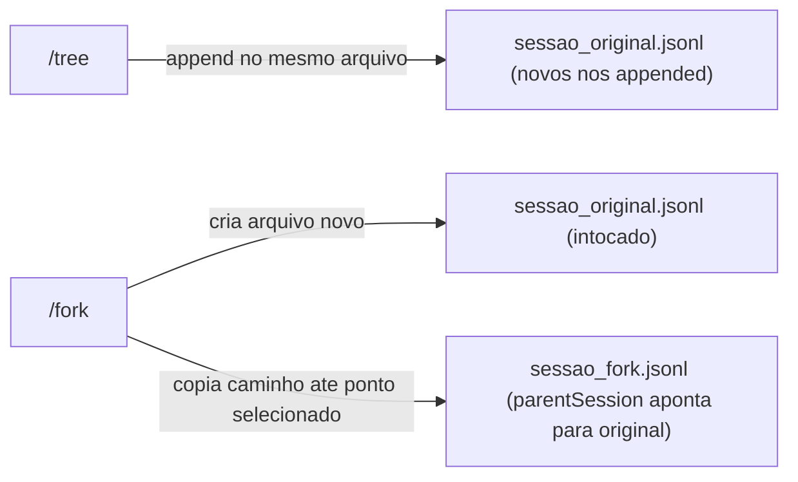

# Conceitos: Fork e Branch na Prática — Criar e Navegar

> _Aula contínua dos conceitos atômicos deste subcapítulo. Cada conceito vira uma seção `## N.` (ou `## 0N.` quando o roteiro tem 10+ conceitos) preenchida em sequência pela skill `estudo-explicar-conceito`. Cada nova iteração lê o que já foi escrito e dá continuidade — sem repetir vocabulário, sem reapresentar exemplos, sem saltos de tom._

## Roteiro

1. Branch via TUI — o comando `/tree`, como navegar a árvore com setas e selecionar um nó anterior, e o que o harness escreve no arquivo JSONL ao confirmar (novos nós com `parentId` apontando para o nó selecionado, sem criar arquivo novo)
2. Branch via SDK — o método `branch(entryId)` da interface `SessionManager`, o que ele retorna (o `leafId` do novo nó criado), e como usar esse `leafId` para continuar a conversa programaticamente a partir do ponto escolhido
3. `branchWithSummary()` vs `branch()` — o que `branchWithSummary(id, summary)` faz diferente: injeta um `BranchSummaryEntry` antes de continuar, quando usar cada forma, e a implicação para quem serializa o arquivo para persistência externa
4. Fork via TUI — o comando `/fork` na sessão ativa, o que ele cria no disco (novo arquivo `.jsonl` no diretório de sessões), e o campo `parentSession` no `SessionHeader` do arquivo filho que aponta para o caminho absoluto do arquivo original
5. Fork via SDK — `SessionManager.forkFrom(sourcePath, targetCwd)` e sua variante de fork parcial por `entryId`, o que o método retorna, e por que edições no arquivo filho não alteram o arquivo pai (independência completa entre arquivos)
6. Implicação operacional para persistência externa — quando haverá um arquivo novo que precisa ser replicado/sincronizado (fork) vs. quando o arquivo existente cresce de forma não-linear (branch), e o que isso significa concretamente para estratégias de sincronização com EFS ou S3

<!-- ROTEIRO-END -->

## 1. Branch via TUI — o comando `/tree`, como navegar a árvore com setas e selecionar um nó anterior, e o que o harness escreve no arquivo JSONL ao confirmar (novos nós com `parentId` apontando para o nó selecionado, sem criar arquivo novo)

O `parentId` que o subcapítulo anterior estabeleceu como campo de cada entrada é o que torna o branch possível: porque cada nó aponta para seu pai, o harness consegue reconstruir qualquer caminho da árvore lendo o arquivo de trás para frente. O `/tree` é a interface que expõe essa estrutura ao usuário durante uma sessão TUI ativa.

Ao digitar `/tree`, o harness exibe o arquivo JSONL como uma árvore visual no terminal — cada entrada aparece como um nó, branches divergentes são mostrados como ramificações laterais, e labels definidos pelo usuário (vistos no subcapítulo `03-entradas-especiais-compaction-branchsummary-e-labels`) ficam visíveis como marcadores de navegação. As setas `↑/↓` movem a seleção linha a linha entre entradas visíveis. `Ctrl+←` / `Ctrl+→` (ou `Alt+←` / `Alt+→`) operam em granularidade maior: dobram/desdobram nós e saltam entre os pontos onde a árvore se bifurca — os "segment starts" de cada branch. Isso torna a navegação em árvores grandes prática, porque o leitor pode pular direto de bifurcação em bifurcação sem percorrer centenas de nós intermediários. `Ctrl+O` cicla filtros de visualização: padrão, sem-ferramentas, apenas-usuário, apenas-labels, todos.

O comportamento ao pressionar `Enter` depende do tipo da entrada selecionada. Para entradas do tipo `user` ou `custom`, o harness move o leaf para o **pai** da entrada selecionada e coloca o texto da entrada no editor — a ideia é que você possa editar e reenviar aquela mensagem, criando um branch a partir do ponto imediatamente anterior ao que selecionou. Para entradas do tipo `assistant`, `tool`, `compaction` ou outras, o harness simplesmente move o leaf para aquela entrada e deixa o editor vazio, permitindo que você escreva a próxima mensagem a partir dali.

Em ambos os casos, quando o usuário confirma a continuação, o que acontece no arquivo JSONL é apenas **append**: o harness escreve novas entradas ao final do arquivo, cada uma com `parentId` apontando para o nó selecionado. O conteúdo anterior do arquivo não é alterado. Os nós do branch antigo que ficaram "sem descendente" continuam presentes no arquivo — a árvore preserva todos os caminhos. Nenhum arquivo novo é criado; o mesmo `.jsonl` que já existia cresce. Esse é o contrato que distingue branch de fork, e é o que torna o branch transparente do ponto de vista de persistência: quem sincroniza o arquivo com EFS ou S3 lida com um único arquivo que só cresce por appends.

```
Arquivo JSONL antes do branch:

{"id":"a1","parentId":null,...}   ← raiz (SessionHeader)
{"id":"b2","parentId":"a1",...}   ← turno 1 (user)
{"id":"c3","parentId":"b2",...}   ← turno 1 (assistant)
{"id":"d4","parentId":"c3",...}   ← turno 2 (user)
{"id":"e5","parentId":"d4",...}   ← turno 2 (assistant)

Usuário abre /tree, seleciona "c3" e escreve nova mensagem:

{"id":"f6","parentId":"c3",...}   ← turno 2 alternativo (user) — appended
{"id":"g7","parentId":"f6",...}   ← resposta do novo branch (assistant) — appended
```

O leaf agora é `g7`. O caminho ativo é `a1 → b2 → c3 → f6 → g7`. Os nós `d4` e `e5` continuam no arquivo, mas não fazem parte do contexto que o LLM recebe — o harness monta o contexto percorrendo a cadeia de `parentId` do leaf atual até a raiz. O arquivo inteiro nunca é reescrito.

## 2. Branch via SDK — o método `branch(entryId)` da interface `SessionManager`, o que ele retorna (o `leafId` do novo nó criado), e como usar esse `leafId` para continuar a conversa programaticamente a partir do ponto escolhido

O conceito anterior mostrou o branch pelo ângulo do usuário no terminal: setas, Enter, append silencioso no arquivo. O SDK expõe exatamente o mesmo mecanismo de `parentId`-redirect, mas como chamada de método — o que permite automatizar workflows de "retry", construir seletores de branch em interfaces web, ou implementar lógica de rollback programático sem depender de interação humana na TUI.

O ponto de entrada é `sm.branch(entryId)`, onde `sm` é uma instância de `SessionManager` e `entryId` é o `id` de qualquer entrada já existente no arquivo JSONL da sessão. O que o método faz internamente é simples: ele reposiciona o **leaf** da sessão para o entry especificado — ou mais precisamente, para o ponto imediatamente após esse entry, de forma que a próxima mensagem enviada ao harness tenha `parentId` igual a `entryId`. O arquivo JSONL não é reescrito; os nós existentes permanecem intocados. O método retorna o `leafId` — o `id` do nó que passa a ser o novo leaf ativo. Esse `leafId` é o que você precisa armazenar se quiser referenciar o estado do branch depois (por exemplo, para construir um selector visual mostrando os branches abertos naquela sessão).

Para descobrir os `entryId`s disponíveis antes de chamar `branch()`, o SDK oferece um pequeno conjunto de métodos de travessia: `getEntries()` retorna todas as entradas do arquivo como array; `getTree()` retorna a estrutura hierárquica como `SessionTreeNode`; `getPath()` retorna o caminho linear da raiz até o leaf atual; `getEntry(id)` recupera uma entrada específica; e `getChildren(id)` lista os filhos imediatos de um nó. Na prática, um workflow de "retry from here" em código parece com isso:

```typescript
import { SessionManager } from "@mariozechner/pi-coding-agent";

const sm = SessionManager.open("/home/user/.pi/sessions/abc123.jsonl");

// inspecionar o caminho atual: raiz → ... → leaf
const path = sm.getPath();
const entries = sm.getEntries();

// encontrar o nó do último turno do usuário
const lastUserEntry = [...path].reverse().find(e => e.role === "user");

// reposicionar o leaf para o pai desse turno
// (equivalente a selecionar aquele nó no /tree e pressionar Enter)
const newLeafId = sm.branch(lastUserEntry!.parentId!);

// agora o contexto que o LLM recebe, quando você enviar o próximo prompt,
// termina em lastUserEntry.parentId — a mensagem do usuário e a resposta
// do assistente que vieram depois são "invisíveis" ao LLM, mas ainda no arquivo
```

Um detalhe que confunde na primeira leitura: `branch(entryId)` não cria imediatamente nenhuma nova linha no arquivo JSONL. A linha nova (com `parentId = entryId`) só aparece quando você envia o próximo prompt ao harness via `AgentSession.prompt()` ou equivalente. O `leafId` retornado por `branch()` não é, portanto, o `id` de um nó recém-escrito — é simplesmente o `id` do nó para o qual o leaf foi movido, servindo de referência para você saber "de onde" o próximo prompt vai partir. Isso é importante para quem vai persistir o estado do branch externamente (por exemplo, guardar `{ sessionPath, leafId }` numa tabela DynamoDB para que uma chamada futura da API retome exatamente aquele ponto): você precisa guardar o `leafId` retornado por `branch()`, não esperar que um novo nó apareça no arquivo antes de persistir.

O contrato de append-only do arquivo se mantém intacto: depois que `branch()` reposiciona o leaf e você envia um prompt, o harness appenda os novos nós (`user`, `assistant`, eventuais `tool_use`) ao fim do arquivo, cada um com `parentId` apontando para o nó selecionado. O arquivo continua crescendo linearmente no disco — é só o ponteiro lógico de "qual é o leaf atual" que mudou. Para quem sincroniza via EFS ou S3, não há nenhum evento especial a detectar no momento da chamada a `branch()` — a mudança relevante para persistência ocorre no próximo append.

## 3. `branchWithSummary()` vs `branch()` — o que `branchWithSummary(id, summary)` faz diferente: injeta um `BranchSummaryEntry` antes de continuar, quando usar cada forma, e a implicação para quem serializa o arquivo para persistência externa

O conceito anterior mostrou que `branch(entryId)` reposiciona o leaf sem deixar rastro imediato no arquivo — a linha nova só aparece no próximo prompt. O `branchWithSummary(entryId, summary, details?, fromHook?)` faz exatamente o mesmo reposicionamento, mas com um passo a mais antes: ele injeta no arquivo uma entrada do tipo `branch_summary` entre o ponto de divergência e o próximo prompt. Esse nó extra é o `BranchSummaryEntry`, e entender por que ele existe exige voltar ao problema de contexto que o branch cria.

Quando o usuário (ou o código) muda de branch, o LLM que vai receber o próximo prompt não tem como ver o que aconteceu no branch abandonado — ele só recebe o caminho da raiz até o leaf atual. Se o branch abandonado continha um diagnóstico importante, uma tentativa que falhou por motivo específico, ou código que foi explorado mas descartado, esse conhecimento desaparece do contexto. O agente na nova branch pode voltar a explorar o mesmo caminho e cometer os mesmos erros, sem saber que aquela strada já foi testada. A `BranchSummaryEntry` é a resposta a esse problema: um nó que carrega um resumo do que foi feito no caminho abandonado, inserido como contexto antes do próximo prompt, tornando aquela informação visível ao LLM mesmo que os nós originais do branch estejam "invisíveis" pelo parentId.

O formato da entrada no arquivo JSONL é direto:

```json
{
  "type": "branch_summary",
  "id": "g7h8i9j0",
  "parentId": "a1b2c3d4",
  "timestamp": "2024-12-03T14:15:00.000Z",
  "fromId": "f6g7h8i9",
  "summary": "Branch anterior explorou abordagem A; falhou por X; descartada.",
  "details": { "readFiles": [...], "modifiedFiles": [...] }
}
```

O campo `fromId` aponta para a entrada do branch abandonado de onde o resumo foi extraído. O `parentId` aponta para o ponto de divergência — o mesmo nó que teria sido destino de `branch()` simples. O `summary` é o texto que o LLM vai ver como contexto antes de receber o próximo prompt. O campo `details` (opcional) registra quais arquivos foram lidos ou modificados no branch abandonado, permitindo que o agente saiba que um arquivo foi tocado naquele caminho, mesmo sem acesso ao conteúdo completo das operações de ferramenta.

A TUI usa `branchWithSummary` automaticamente quando o usuário navega pelo `/tree` e escolhe gerar um resumo do branch que está deixando — o harness chama o LLM para produzir o `summary` e o injeta como `BranchSummaryEntry` antes de continuar. Via SDK, a responsabilidade do conteúdo do `summary` é sua: você fornece o texto manualmente. Isso é deliberado — num workflow automatizado, o código frequentemente já sabe o que aconteceu naquele branch (era um retry, um experimento A/B, uma tentativa com parâmetros específicos) e pode gerar um resumo mais preciso do que um LLM produziria lendo os nós em retrospecto.

A escolha entre `branch()` e `branchWithSummary()` é, portanto, uma escolha sobre contexto: use `branch()` quando o branch que está sendo abandonado não tem informação que precisa sobreviver (você está simplesmente voltando a um ponto mais cedo sem ter acumulado trabalho relevante), e use `branchWithSummary()` quando o branch abandonado continha esforço — diagnóstico, código, resultados de ferramentas — que o agente na nova branch precisa conhecer para não repetir ou para se beneficiar daquele trabalho.

Para quem projeta persistência externa, a diferença entre as duas formas cria uma obrigação prática. Com `branch()` simples, não há nenhuma linha nova no arquivo até o próximo prompt — o que significa que o momento de sincronização com S3 ou EFS pode aguardar o append natural do próximo turno. Com `branchWithSummary()`, o harness escreve a `BranchSummaryEntry` imediatamente, antes de qualquer prompt — o arquivo cresce no instante da chamada. Se a sua lógica de sincronização é orientada a "quando há novo conteúdo no arquivo", ela precisa ser capaz de reagir a esse append imediato que não está associado a um prompt do usuário. Num cenário de S3 com upload por evento de append, a distinção importa para não criar uma janela onde o arquivo local divergiu do arquivo no bucket mas a sincronização ainda não disparou. Nos capítulos 8 e 9 — EFS e `SessionManager` sobre S3 — esse comportamento será o ponto de partida para decidir quando e como disparar a cópia do arquivo.

Vale registrar um detalhe de versão que a comunidade encontrou na prática: houve um período (em torno da versão 0.55.4) em que `branchWithSummary` injetava a `BranchSummaryEntry` corretamente no arquivo mas não atualizava o contexto interno do harness de forma consistente, causando vazamento de contexto entre branches. Isso foi tratado como bug (issue #1781) e corrigido em versão posterior. Se o seu ambiente usa uma versão próxima a 0.55.x e você observa que o LLM "adivinha" conteúdo do branch abandonado sem que tenha sido explicitamente dito, vale verificar a versão instalada do `@mariozechner/pi-coding-agent` antes de atribuir o comportamento à lógica de persistência.

**Fontes utilizadas:**

- [Session Tree Navigation — pi.dev/docs/latest/tree](https://pi.dev/docs/latest/tree)
- [Managing Context Windows with pi /tree — StackToHeap](https://stacktoheap.com/blog/2026/02/26/pi-tree-context-window-management/)
- [Pi Coding Agent — README oficial (badlogic/pi-mono)](https://github.com/badlogic/pi-mono/blob/main/packages/coding-agent/README.md)
- [Session Management and Persistence — DeepWiki (agentic-dev-io/pi-agent)](https://deepwiki.com/agentic-dev-io/pi-agent/2.4-session-management-and-persistence)
- [Pi Coding Agent — SDK docs (badlogic/pi-mono)](https://github.com/badlogic/pi-mono/blob/main/packages/coding-agent/docs/sdk.md)
- [How to Build a Custom Agent Framework with PI — Nader Dabit](https://gist.github.com/dabit3/e97dbfe71298b1df4d36542aceb5f158)
- [Compaction and Context Management — DeepWiki (agentic-dev-io/pi-agent)](https://deepwiki.com/agentic-dev-io/pi-agent/2.5-compaction-and-context-management)
- [Session Format — pi.dev/docs/latest/session-format](https://pi.dev/docs/latest/session-format)
- [branchWithSummary does not implement Tree Navigation — Issue #1781 (badlogic/pi-mono)](https://github.com/badlogic/pi-mono/issues/1781)

## 4. Fork via TUI — o comando `/fork` na sessão ativa, o que ele cria no disco (novo arquivo `.jsonl` no diretório de sessões), e o campo `parentSession` no `SessionHeader` do arquivo filho que aponta para o caminho absoluto do arquivo original

O contraste com o `/tree` é o ponto de entrada mais direto: enquanto `/tree` navega e cria branches dentro do arquivo atual — todos os novos nós ainda vão para o mesmo `.jsonl`, como vimos nos conceitos 1 e 2 — o `/fork` materializa uma intenção diferente: criar uma sessão nova, independente, que começa a partir de algum ponto do histórico atual. O resultado no disco é inequívoco: um arquivo `.jsonl` a mais onde antes havia um.

Quando o usuário digita `/fork` numa sessão TUI ativa, o harness abre um seletor de mensagens de usuário — o mesmo tipo de UI que `/tree` usa para exibir o histórico, mas filtrado para mostrar apenas entradas do tipo `user` no caminho ativo. O usuário navega pelas mensagens, seleciona aquela que quer usar como ponto de partida do fork, e pressiona Enter. O harness então copia o caminho linear da raiz até aquela mensagem selecionada para um novo arquivo `.jsonl`, coloca o texto da mensagem selecionada no editor para edição, e entrega o controle de volta ao usuário — que está agora escrevendo numa sessão completamente nova, com o contexto histórico preservado até aquele ponto.

O novo arquivo segue o padrão de nomenclatura `~/.pi/agent/sessions/--<cwd-sanitizado>--/<timestamp>_<uuid>.jsonl`. Seu `SessionHeader` — a primeira linha do arquivo, não parte da árvore de `parentId` — contém o campo `parentSession` apontando para o caminho absoluto do arquivo de origem:

```json
{
  "type": "session",
  "version": 3,
  "id": "novo-uuid",
  "timestamp": "2024-12-03T15:00:00.000Z",
  "cwd": "/path/to/project",
  "parentSession": "/home/user/.pi/agent/sessions/--path--/20241203_abc123.jsonl"
}
```

Esse campo é somente informativo — o harness não vai buscar entradas no arquivo pai quando montar o contexto para o LLM. O arquivo filho é autossuficiente: as entradas copiadas do caminho até o ponto de fork estão fisicamente presentes nele como linhas JSONL normais, com seus próprios `id`s e `parentId`s. O `parentSession` existe para rastreabilidade — permite que ferramentas de gerenciamento de sessão (ou o próprio usuário) descubram de onde aquele arquivo nasceu, construam grafos de genealogia entre sessões, ou implementem "listar todas as sessões derivadas desta" sem precisar escanear o conteúdo de cada arquivo.

O arquivo original não é tocado em nenhum momento durante o `/fork`. Nenhuma linha é adicionada, nenhum campo é atualizado, nenhum metadado no arquivo de origem registra que um fork foi criado a partir dele. Isso tem uma implicação direta: o arquivo pai não sabe que tem filhos. A relação de parentesco é gravada apenas no filho, via `parentSession`. Para quem constrói uma camada de persistência em S3 ou EFS e precisa manter o grafo de sessões navegável, isso significa que descobrir "quais sessões são forks desta" exige percorrer todos os `SessionHeader`s e filtrar pelos que têm `parentSession` apontando para o arquivo de interesse — não há índice invertido nativo no formato.

A diferença operacional entre `/fork` e `/tree` fica mais clara num diagrama:



O formato do arquivo filho é idêntico ao de qualquer sessão nova: as linhas copiadas do caminho de origem têm seus `id`s originais preservados, a mesma estrutura de `parentId`, e a partir do ponto onde o usuário começa a escrever, novos `id`s são gerados normalmente. Um observador que abrisse o arquivo filho sem olhar o `SessionHeader` não conseguiria distingui-lo de uma sessão que sempre existiu de forma independente — o `parentSession` no header é o único sinal de que ele nasceu como fork.

**Fontes utilizadas:**

- [Pi Coding Agent — README oficial (badlogic/pi-mono)](https://github.com/badlogic/pi-mono/blob/main/packages/coding-agent/README.md)
- [Session Format — pi.dev/docs/latest/session-format](https://pi.dev/docs/latest/session-format)
- [Session Management and Persistence — DeepWiki (agentic-dev-io/pi-agent)](https://deepwiki.com/agentic-dev-io/pi-agent/2.4-session-management-and-persistence)
- [Pi Sessions — pi.dev/docs/latest/sessions](https://pi.dev/docs/latest/sessions)

## 5. Fork via SDK — `SessionManager.forkFrom(sourcePath, targetCwd)` e sua variante de fork parcial por `entryId`, o que o método retorna, e por que edições no arquivo filho não alteram o arquivo pai (independência completa entre arquivos)

O conceito anterior mostrou o fork pelo ângulo do terminal: o usuário digita `/fork`, o harness abre um seletor de mensagens, um novo arquivo `.jsonl` nasce no disco com `parentSession` apontando para o original. O SDK expõe a mesma família de operações em duas superfícies distintas, com semântica levemente diferente dependendo do ponto de entrada que você usa.

A primeira superfície é o `SessionManager` estático. O método `SessionManager.forkFrom(sourcePath, targetCwd, sessionDir?)` cria um fork de uma sessão que pertence a outro projeto — ou seja, cujo arquivo `.jsonl` vive num diretório de sessões diferente do projeto atual. O `sourcePath` é o caminho absoluto do arquivo `.jsonl` de origem; `targetCwd` é o diretório de trabalho do projeto destino (que define onde o novo arquivo será criado, seguindo o padrão `~/.pi/agent/sessions/--<targetCwd-sanitizado>--/<timestamp>_<uuid>.jsonl`); `sessionDir?` é opcional e permite sobrescrever o diretório de sessões do destino quando você não quer usar o padrão da home. O método retorna uma instância de `SessionManager` já aberta sobre o novo arquivo — você pode chamar `sm.getPath()`, `sm.getEntries()` e demais métodos de travessia imediatamente, sem nenhuma operação extra de abertura. O arquivo de origem não é tocado: o `forkFrom` lê as entradas da origem, copia o caminho linear da raiz até o leaf atual para o novo arquivo, e fecha a origem sem modificar nenhuma linha.

A segunda superfície é `createBranchedSession(leafId)`, chamado sobre uma instância de `SessionManager` já aberta. Este é o fork parcial por `entryId`: em vez de copiar o caminho inteiro até o leaf atual, ele copia o caminho da raiz até o nó identificado por `leafId` — o que corresponde ao que o usuário faz quando, no `/fork` da TUI, seleciona uma mensagem que não é a última. O retorno é uma nova instância de `SessionManager` sobre um arquivo `.jsonl` recém-criado no mesmo diretório de sessões que o arquivo de origem. Assim como no `/fork` via TUI, o `parentSession` do `SessionHeader` do novo arquivo aponta para o caminho absoluto do arquivo pai; o arquivo pai permanece completamente intocado.

Há também a superfície de runtime — `runtime.fork(entryId, options?)` — que opera sobre a sessão ativa de uma `AgentSessionRuntime`. A diferença para os dois métodos acima é que `runtime.fork()` substitui a sessão ativa do runtime pelo novo arquivo, o que implica que `runtime.session` muda após a chamada e qualquer subscriber de eventos precisa re-assinar na nova sessão. É a forma correta quando você quer que o harness (inclusive o loop de eventos, o executor de ferramentas, o gerenciamento de contexto) passe a operar sobre o arquivo filho imediatamente — útil em extensões que programaticamente fazem fork e continuam enviando prompts na mesma execução.

A independência entre arquivo pai e arquivo filho é estrutural, não contratual. O novo `.jsonl` tem seu próprio mapa de entradas em memória, sua própria instância de `SessionManager`, e seus próprios `id`s gerados a partir do momento que o fork foi criado. Quando você faz `sm.getEntries()` no filho, o método lê exclusivamente o arquivo filho — as entradas copiadas da origem estão fisicamente presentes como linhas no arquivo filho, com os mesmos `id` e `parentId` originais, mas o arquivo pai não sabe que foi lido. Appends subsequentes no filho (novos prompts, respostas do LLM, chamadas de ferramenta) vão exclusivamente para o arquivo filho. Não há mecanismo de callback, listener ou lock que conecte os dois arquivos depois da criação — depois que `forkFrom` ou `createBranchedSession` retorna, os dois arquivos são cidadãos de primeira classe sem referência mútua além do `parentSession` no header.

Isso tem uma consequência direta para quem implementa persistência: ao detectar que um fork foi realizado via SDK, o que você precisa sincronizar com S3 ou replicar via EFS é o **novo arquivo** — o arquivo pai não mudou e não precisa ser re-enviado. No caso de `runtime.fork()`, o evento que sinaliza a criação pode ser capturado ouvindo a substituição do `runtime.session` — é o único hook disponível para detectar o fork de forma síncrona no código do handler. Nos capítulos 8 e 9, quando o mecanismo de sincronização é construído sobre EFS e S3 respectivamente, este comportamento de "um fork = um arquivo novo no disco" é o dado que determina se a estratégia de upload é incremental (só o arquivo que cresceu) ou completa (todos os arquivos da sessão re-enviados). O subcapítulo `05-append-only-como-contrato-de-persistencia-efs-vs-s3` desenvolve exatamente essa tensão.

**Fontes utilizadas:**

- [Pi Coding Agent — SDK docs (badlogic/pi-mono)](https://github.com/badlogic/pi-mono/blob/main/packages/coding-agent/docs/sdk.md)
- [Session Management and Persistence — DeepWiki (agentic-dev-io/pi-agent)](https://deepwiki.com/agentic-dev-io/pi-agent/2.4-session-management-and-persistence)
- [Pi Coding Agent — README oficial (badlogic/pi-mono)](https://github.com/badlogic/pi-mono/blob/main/packages/coding-agent/README.md)
- [Pi Sessions — pi.dev/docs/latest/sessions](https://pi.dev/docs/latest/sessions)
- [@mariozechner/pi-coding-agent — npm](https://www.npmjs.com/package/@mariozechner/pi-coding-agent)

## 6. Implicação operacional para persistência externa — quando haverá um arquivo novo que precisa ser replicado/sincronizado (fork) vs. quando o arquivo existente cresce de forma não-linear (branch), e o que isso significa concretamente para estratégias de sincronização com EFS ou S3

Os conceitos 1 a 5 construíram o vocabulário completo: branch appenda novos nós no mesmo `.jsonl`, fork cria um `.jsonl` separado com `parentSession` no header, `branchWithSummary()` grava imediatamente uma `BranchSummaryEntry` enquanto `branch()` simples não grava nada até o próximo prompt, e `runtime.fork()` substitui a sessão ativa do runtime. A partir dessas diferenças mecânicas, as consequências para qualquer camada de persistência externa são diretas — e diferentes o suficiente entre branch e fork para exigir tratamento distinto nos capítulos 8 e 9.

Para branch, a premissa é: **um arquivo, crescendo**. O evento relevante para sincronização é sempre um append ao arquivo já existente, seja a `BranchSummaryEntry` imediata de `branchWithSummary()`, seja o primeiro nó do novo turno após `branch()` simples. No EFS, esse append é transparente: o arquivo cresce em bytes, e qualquer Lambda que montar o mesmo access point enxerga os novos bytes imediatamente via semântica POSIX — não há ação especial que a camada de persistência precise tomar ao detectar que houve um branch. No S3, o paradigma é diferente: o arquivo cresce localmente na Lambda, e a sincronização para o bucket é um `PutObject` que substitui o objeto inteiro. O S3 tem consistência forte para `PutObject` desde dezembro de 2020, então um leitor que chamar `GetObject` após o `PutObject` completar verá a versão nova — mas "após o `PutObject` completar" é o ponto crítico: há uma janela entre o append local e o upload para o bucket onde o arquivo no disco diverge do objeto no S3. Para branch, essa janela é gerenciável — você decide se sincroniza por append (a cada turno) ou em batch (ao fim da sessão) com base no trade-off entre custo de `PutObject` e risco de perda.

Para fork, a premissa muda: **um arquivo novo nasce**. O evento relevante para sincronização não é um append num arquivo já rastreado, é a criação de um `.jsonl` que a camada de persistência ainda não conhece. No EFS isso continua transparente do ponto de vista do harness — o arquivo aparece no sistema de arquivos compartilhado, e qualquer Lambda com o access point montado o encontra por listagem de diretório. O problema para EFS não é detectar o novo arquivo, é garantir que o access point cubra o diretório correto (o `~/.pi/agent/sessions/--<cwd-sanitizado>--/`) para o projeto do arquivo filho, que pode ter um `targetCwd` diferente do projeto do arquivo pai. No S3, o novo arquivo é invisível para o bucket até que o código execute um `PutObject` com a chave correta — e o evento que dispara esse `PutObject` precisa ser reconhecido pelo handler. A superfície de runtime fornece exatamente esse gancho: o evento `session_start` com `reason: "fork"` e `previousSessionFile` permite que uma extension registrada no harness reaja à criação do fork e enfileire a sincronização do novo arquivo antes do primeiro prompt ser enviado.

| Operação | Arquivo no disco | Evento para sincronização | EFS | S3 |
|---|---|---|---|---|
| `branch()` / `/tree` | mesmo `.jsonl` cresce | próximo append (turno seguinte) | transparente — NFS vê o append | `PutObject` do arquivo existente na chave já rastreada |
| `branchWithSummary()` | mesmo `.jsonl` cresce | append imediato da `BranchSummaryEntry` | transparente | `PutObject` pode ser antecipado para capturar o append imediato |
| `/fork` via TUI | novo `.jsonl` criado | criação do arquivo (novo objeto) | arquivo aparece no filesystem; acesso via access point correto | `PutObject` em chave nova; handler precisa descobrir o novo caminho |
| `forkFrom()` / `createBranchedSession()` via SDK | novo `.jsonl` criado | retorno do método (síncrono) | arquivo aparece no filesystem | `PutObject` em chave nova; código pode reagir diretamente ao retorno do método |
| `runtime.fork()` | novo `.jsonl` criado; runtime substituído | evento `session_start` com `reason: "fork"` | arquivo aparece no filesystem | extension ouve `session_start` e registra novo path para upload |

Uma distinção que importa para design: com EFS, a preocupação central de fork é **coverage** — garantir que o diretório de sessões do arquivo filho esteja coberto pelo mesmo ponto de montagem que o Lambda usa. Com S3, a preocupação central é **discovery** — garantir que o código que faz upload saiba que um novo arquivo apareceu no disco local e qual chave de S3 usar para ele. No capítulo 9, quando o `SessionManager` customizado backed por S3 for construído, o hook mais limpo para discovery de fork é exatamente o evento `session_start { reason: "fork", previousSessionFile }`, que expõe tanto o path do novo arquivo (via `runtime.session.sessionFile`) quanto o path do arquivo de origem — o suficiente para computar a chave do novo objeto no bucket e enfileirar o upload inicial.

A consequência assimétrica mais importante: **um branch nunca exige atenção ao número de arquivos; um fork sempre exige**. Uma estratégia de sincronização que só rastreia "o arquivo da sessão atual" (aberto quando o handler foi invocado) funciona perfeitamente para qualquer sequência de branches — o arquivo é sempre o mesmo, só cresce. Para forks, a mesma estratégia falha silenciosamente: o arquivo filho nasce num path diferente, o handler que só conhecia o path do pai nunca faz upload do filho, e a sessão derivada some na próxima falha da Lambda. O subcapítulo `05-append-only-como-contrato-de-persistencia-efs-vs-s3` aprofunda as restrições de cada estratégia; o capítulo 9 mostra como implementar o `SessionManager` customizado que resolve o problema de discovery de fork no S3.

**Fontes utilizadas:**

- [Session Management and Persistence — DeepWiki (agentic-dev-io/pi-agent)](https://deepwiki.com/agentic-dev-io/pi-agent/2.4-session-management-and-persistence)
- [Pi Coding Agent — README oficial (badlogic/pi-mono)](https://github.com/badlogic/pi-mono/blob/main/packages/coding-agent/README.md)
- [Pi Coding Agent — Extensions docs (badlogic/pi-mono)](https://github.com/badlogic/pi-mono/blob/main/packages/coding-agent/docs/extensions.md)
- [AWS S3 Data Consistency Model — jayendrapatil.com](https://jayendrapatil.com/aws-s3-data-consistency-model/)
- [Architecture Layers That S3 Files Eliminates — and Creates — DEV Community](https://dev.to/aws-builders/architecture-layers-that-s3-files-eliminates-and-creates-16ke)
- [Amazon S3 Files — AWS](https://aws.amazon.com/s3/features/files/)

<!-- PENDENTE-START -->
> _Pendente: 6 / 6 conceitos preenchidos._
<!-- PENDENTE-END -->

---

**Próximo subcapítulo** → [Append-Only Como Contrato de Persistência — EFS vs S3](../05-append-only-como-contrato-de-persistencia-efs-vs-s3/CONTENT.md)
